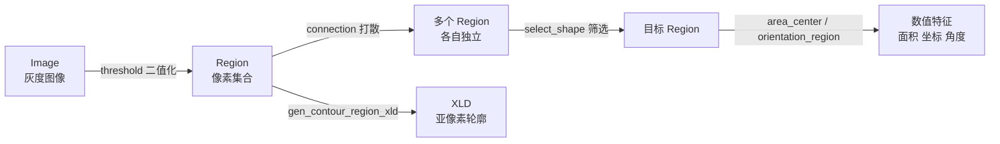
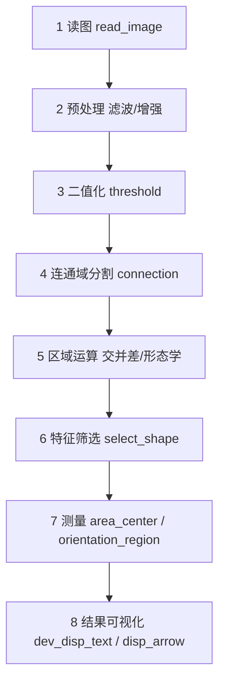

---
tags:
  - Halcon
  - MOC
aliases:
  - Halcon 学习地图
  - Halcon 索引
created: 2026-09-16
---

# Halcon 学习地图

> [!info] 这个库是什么
> 本仓库是 HALCON 机器视觉的学习笔记库。原始练习代码存放在 `note/` 目录下的 `.hdev` 文件（HDevelop 工程，本质是 XML，可用文本编辑器打开），本目录下的笔记是对这些练习的**整理、补全与原理说明**。

## 一、HALCON 的三大数据对象

HALCON 里所有算子都在操作这三类对象，先建立这个心智模型，后面看代码就不会迷路。

| 对象 | 含义 | 典型来源 | 典型算子 |
|---|---|---|---|
| **Image** | 灰度/彩色图像矩阵，每个像素有灰度值 | `read_image`、`scale_image`、`mean_image` | 图像处理后仍得到 Image |
| **Region** | 像素集合，只记录"哪些行/列属于我"，**不含灰度** | `threshold`、`gen_circle`、`connection` | 面积、周长、筛选 |
| **XLD** | 亚像素轮廓（Contour / Polygon），由点序列构成 | `edges_sub_pix`、`gen_contour_region_xld` | 高精度测量、拟合 |



> [!tip] 一句话记忆
> **Image 管"亮不亮"，Region 管"在哪里"，XLD 管"边界有多准"。** 图像处理（滤波、增强）在 Image 上做，形态学与测量在 Region 上做，高精度测量才需要 XLD。

## 二、Blob 分析的标准流程

`note/` 里的练习几乎都是这条主线上的不同环节，建议按顺序吃透。



> [!tip] 第 7 步之后还有一条支线：几何变换
> 拿到 `(Row, Column, Phi)` 之后，除了直接显示，还能用它们**构造齐次矩阵**，把目标搬到想要的位置 —— 这就是 [[11 仿射变换矩阵与图像变换]] 与 [[12 仿射变换实战 区域轮廓与抠图]] 的内容：
>
> ```mermaid
> flowchart LR
>     G["7 测量<br/>Row, Column, Phi"] --> M["构造 HomMat2D<br/>vector_angle_to_rigid"]
>     M --> T1["affine_trans_image<br/>变换图像（要重采样）"]
>     M --> T2["affine_trans_region<br/>变换区域（二值掩膜）"]
>     M --> T3["affine_trans_contour_xld<br/>变换轮廓（最快最准）"]
>     M --> T4["reduce_domain + crop_domain<br/>抠出 ROI 当模板"]
> ```
> 一句话概括：**测量给出"目标在哪、朝向如何"，仿射变换负责"把它挪到该在的地方"。**

> [!tip] 第 4 步"抠出 ROI"之后还有一条支线：模板匹配
> 上面那条支线末尾提到的 `reduce_domain` 抠 ROI，**正是模板匹配的起点** ——
> 把 ROI 交给 `create_shape_model` 训练成模型，再用 `find_shape_model` 在整幅图里按**轮廓形状**把它找出来：
>
> ```mermaid
> flowchart LR
>     R["reduce_domain<br/>抠出 ROI"] --> C["create_shape_model<br/>训练 → ModelID"]
>     C --> F["find_shape_model<br/>→ Row, Column, Angle, Score"]
>     C --> G["get_shape_model_contours<br/>轮廓（原点在 0,0）"]
>     F --> H["hom_mat2d_* + affine_trans_contour_xld<br/>把轮廓搬到结果位置"]
>     G --> H
> ```
> 一句话概括：**Blob 是"按长相筛"，模板匹配是"照着照片找人"。** 完整参数拆解见 [[14 模板匹配 形状匹配]]。

> [!tip] 第 7 步"测量"还有一条支线：2D 计量 + 先定位后测量
> `area_center` 只能给到"像素级质心"。要**亚像素级地量一条直线 / 一个圆 / 一个矩形**，用的是 **2D Metrology**：
> 画一个近似形状 → HALCON 沿边界自动摆一排卡尺 → 逐个卡尺提边缘 → RANSAC 拟合成真实几何形状。
>
> ```mermaid
> flowchart LR
>     S["画近似形状<br/>draw_line / draw_circle"] --> M["create_metrology_model<br/>+ add_metrology_object_*_measure"]
>     M --> A["apply_metrology_model"]
>     A --> R["get_metrology_object_result<br/>圆: row,column,radius<br/>线: 起点+终点<br/>矩形: row,column,phi,l1,l2"]
>     R --> D["distance_pp / distance_pl / distance_cc / distance_lc<br/>算出真正的尺寸"]
>     P["find_shape_model<br/>定位 Row,Column,Angle"] --> RS["set_metrology_model_param<br/>'reference_system'（只设一次）"]
>     RS --> AL["每张图 align_metrology_model<br/>→ 再 apply"]
> ```
> 完整参数拆解与 13 个坑见 [[15 测量模型 2D Metrology]]。

> [!tip] 还有一条完全独立的支线：识别（读码 / OCR）
> 前面所有笔记都在"找位置、量尺寸"，而**读码与字符识别**问的是"上面写了什么"。
> 它们各自成链，套路却和前面一致 —— **建句柄 → 找 → 取结果（字符串 + 区域）→ 释放句柄**：
>
> ```mermaid
> flowchart LR
>     A["一维条码<br/>create_bar_code_model<br/>find_bar_code"] --> D["DecodedDataStrings<br/>+ SymbolRegions (Region)"]
>     B["二维码<br/>create_data_code_2d_model<br/>find_data_code_2d"] --> E["DecodedDataStrings<br/>+ SymbolXLDs (XLD)"]
>     C["文字 OCR<br/>create_text_model_reader<br/>find_text"] --> F["get_text_result 'class'<br/>+ get_text_object"]
> ```
> 三条链路的参数、码制清单、降噪排查顺序见 [[16 读码与 OCR]]。

> [!tip] 第 5 步里的形态学，还有一个"怎么定半径"的问题
> `opening_circle` / `closing_circle` 的 `Radius` 不该靠试：**缺陷的内切圆半径就是半径的理论下限**（距离变换可算），
> 再贴着它取值即可。完整标定流程与 5 张素材的实测数据见 [[13 形态学调整 结构元半径标定]]。

## 三、笔记索引

| 序号 | 笔记 | 一句话内容 | 对应源码 |
|---|---|---|---|
| 01 | [[01 Halcon语言基础与图像入门]] | 注释/元组/控制流，读图与窗口显示 | 全部文件的公共前置 |
| 02 | [[02 区域与区域集合运算]] | 交集、补集、反选、合并、对称差 | `01交集补集.....hdev` |
| 03 | [[03 二值化与连通域分割]] | threshold + connection + union1/2 | `02合并区域集合.hdev`、`03二值化处理.hdev` |
| 04 | [[04 区域特征与 select_shape 筛选]] | 特征全表 + 筛选写法与坑 | `03二值化处理.hdev`、`04套环检测.hdev` |
| 05 | [[05 图像预处理与滤波]] | 灰度变换、均值/中值滤波、增强 | `05图像预处理.hdev` |
| 06 | [[06 形态学运算]] | 膨胀、腐蚀、开运算、闭运算 | `05图像预处理.hdev` |
| 07 | [[07 区域测量与结果可视化]] | 面积、质心、角度、文字与箭头 | `05曲别针练习.hdev` |
| 08 | [[08 实战 套环检测]] | 遍历文件夹批量检测并计数 | `04套环检测.hdev` |
| 09 | [[09 实战 曲别针计数与角度]] | 计数 + 方向主轴可视化 | `05曲别针练习.hdev` |
| 10 | [[10 算子速查表]] | 按功能分类的算子索引 | —— |
| 11 | [[11 仿射变换矩阵与图像变换]] | 齐次矩阵、Row/Column 约定、刚性矩阵、反解参数 | `仿射变换/01~03*.hdev` |
| 12 | [[12 仿射变换实战 区域轮廓与抠图]] | 三对象变换、区域↔轮廓、ROI 抠图 | `仿射变换/04~07*.hdev` |
| 13 | [[13 形态学调整 结构元半径标定]] | 用距离变换算出半径下限，扫描标定开/闭运算半径 | `形态学调整/1~5.bmp` |
| 14 | [[14 模板匹配 形状匹配]] | 抠 ROI 建形状模型 → `find_shape_model` → 仿射变换回显；含带缩放的 aniso 系列 | `模板匹配/01~03*.hdev` |
| 15 | [[15 测量模型 2D Metrology]] | 画近似形状 → 自动摆卡尺 → RANSAC 拟合；`distance_*` 距离家族；先定位后测量 | `测量/01~05*.hdev`、`测量/my/*.hdev` |
| 16 | [[16 读码与 OCR]] | 一维码 / 二维码 / 文字 OCR 三条链路；降噪排查；`.occ`/`.omc` 分类器 | `读码与OCR/*.hdev` |

## 四、算子命名规律（会读名字就会用一半）

| 前缀 / 后缀 | 含义 | 例子 |
|---|---|---|
| `gen_` | **生成**一个对象 | `gen_circle`（生成圆区域） |
| `get_` | **获取**一个属性/返回值 | `get_image_size`（获取图像宽高） |
| `dev_` | **显示/开发环境**相关，作用于窗口而非图像数据 | `dev_display`、`dev_set_color` |
| `disp_` | **绘制**到窗口（往往是开发期调试用） | `disp_arrow`、`disp_message` |
| `select_` | **筛选**出符合条件的对象 | `select_shape`、`select_obj` |
| `read_` / `write_` | 文件读写 | `read_image`、`write_region` |
| `_circle` / `_rectangle1` / `_rectangle2` | 结构元是**圆** / **正矩形** / **带角度矩形** | `opening_circle` vs `opening_rectangle1` |
| `1` / `2` 结尾 | `1` = 数组形式（一整组），`2` = 两个对象 | `union1`（合并一组）vs `union2`（合并两个） |

## 五、学习自检清单

按这个清单自查，能全部说清楚就说明这一轮学扎实了。

- [ ] 能说出 Image / Region / XLD 三者的区别与转换关系
- [ ] 能默写 Blob 分析八步流程
- [ ] `difference(A, B)` 与 `symm_difference(A, B)` 有什么区别？
- [ ] `complement` 是相对于什么取反？
- [ ] `connection` 之后为什么还要 `union1`？什么时候需要，什么时候多余？
- [ ] `select_shape` 的 `'and'` / `'or'` 分别是什么语义？
- [ ] `'width'` 与 `'inner_width'`、`'outer_radius'` 与 `'inner_radius'` 分别是什么？
- [ ] 开运算与闭运算的顺序，分别消除什么颜色的噪点？
- [ ] 结构元半径该取多大？怎么用距离变换算出它的**理论下限**？
- [ ] `area_center` 输出的 `Row` / `Column` 分别对应 x 还是 y？
- [ ] `orientation_region` 返回的是角度还是弧度？范围是多少？
- [ ] `|Area|` 这种写法是在求什么？
- [ ] `HomMat2D` 在 HALCON 里存成几个数？按什么顺序排？
- [ ] 齐次矩阵变换图像时，`Px` 该传 Row 还是 Column？正角度在屏幕上往哪边转？
- [ ] 多个 `hom_mat2d_*` 叠加时，先写的先作用还是后写的先作用？固定点该写哪个坐标系下的位置？
- [ ] `affine_trans_image` / `region` / `contour_xld` 三者分别适合什么场景？
- [ ] `reduce_domain` 和 `crop_domain` 谁改变了图像矩阵的尺寸？
- [ ] 形状匹配的五步流程是什么？为什么抠模板要用 `reduce_domain` 而不是 `crop_domain`？
- [ ] `create_shape_model` 的 `Metric` 四档分别允许什么样的对比度变化？喂 RGB 图会怎样？
- [ ] 模型的原点默认在哪？`get_shape_model_contours` 取出的轮廓为什么显示在左上角？
- [ ] `find_shape_model` 里 `NumMatches=0` 和 `=1` 分别是什么意思？为什么 `=1` 不一定是最高分？
- [ ] 目标大小会变时该用哪个系列？`ScaleR` 和 `ScaleC` 分别管哪个方向？
- [ ] 2D 计量的五步是什么？`MeasureLength1` 和 `MeasureLength2` 分别管卡尺的哪个方向？
- [ ] `num_measures` 和 `measure_distance` 为什么不能同时生效？卡尺数量下限分别是多少？
- [ ] `all_param` 对 circle / line / rectangle2 的输出顺序各是什么？
- [ ] `get_metrology_object_model_contour` / `..._measures` / `..._result_contour` 分别拿到什么？
- [ ] "先定位后测量"里 `reference_system` 和 `align_metrology_model` 分别在什么时候调用？
- [ ] 一维码 / 二维码 / OCR 三条链路的"建模型—执行—取结果"算子分别叫什么？
- [ ] `get_bar_code_result (…, 'orientation', …)` 返回的是度还是弧度？条码是"深底浅码"时怎么办？
- [ ] 中文路径 / 中文内容读码要加哪一句？
- [ ] `Universal_0-9A-Z_Rej.occ` 这个 OCR 分类器文件名每一段代表什么？

## 六、环境与快捷键备忘

- 版本标记：练习文件基于 `halcon_version="17.12"`，HDevelop 工程文件格式 `file_version="1.1"`。
- 常用快捷键：`F5` 运行全部，`F6` 单步（配合 `stop()` 断点），`F1` 光标停在算子上时打开该算子帮助。
- 帮助文档的正确用法：选中算子按 `F1`，**先看 Signature 看参数顺序，再看 Description 看参数含义**，最后看 Example 抄示例，这是学 HALCON 最快的路径。

> [!warning] 一个常见误区
> HALCON 是**顺序执行**的语言，没有"图像自动刷新"这一说。想看到中间结果，必须显式写 `dev_display`；想清空窗口重画，必须写 `dev_clear_window`。很多"代码没报错但窗口没变化"的问题都源于此。

---
相关：[[01 Halcon语言基础与图像入门]] · [[10 算子速查表]]
