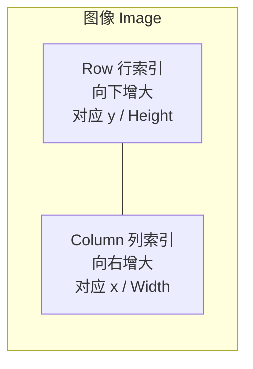

---
tags:
  - Halcon
  - 基础
aliases:
  - Halcon 语法
  - Halcon 窗口显示
created: 2026-09-16
---

# 01 Halcon 语言基础与图像入门

> [!abstract] 一句话总结
> HALCON 是"**变量不用声明、算子按顺序执行**"的脚本语言；图像存在 `Image` 变量里，窗口由 `dev_*` 系列控制，坐标一律以 **Row（行）/ Column（列）** 为单位。

## 一、语言语法要点

### 1.1 赋值与注释

```c
* 这是注释，注释必须独占一行（HALCON 没有行尾注释）
* 下面这种写法是错的，会直接报语法错误：
* threshold (Image, Region, 128, 255)   * 二值化

threshold (Image, Region, 128, 255)      * 算子调用：算子名 (参数, 参数, ...)
```

- **赋值用 `:=`**，比较用 `=`。
- **注释用 `*` 开头且必须是该行第一个非空白字符**，只能整行注释；想给参数加解释只能另起一行写。
- 算子后面**必须跟空格**再写括号，例如 `dev_display (Image)`，写成 `dev_display(Image)` 在部分版本会报语法错误。
- 参数超长时用 `\` 续行：

```c
select_shape (ConnectedRegions, SelectedRegions, \
              ['area','width','height'], 'and', [527.98,38.54,54.38], [10454.1,63.89,1000])
```

### 1.2 元组 Tuple：HALCON 的核心数据结构

**HALCON 里没有"数组"，只有元组（tuple）**。一个变量既可以是一个数，也可以是一串数。

```c
Area := 100                      * 单元素元组
Areas := [100, 200, 300]         * 三元素元组
Row := [10, 20, 30]
Col := [50, 60, 70]

Len := |Areas|                   * 求元组长度 -> 3
First := Areas[0]                * 下标从 0 开始 -> 100
```

三种常用写法对比：

| 写法 | 含义 | 示例 |
|---|---|---|
| `\|Tuple\|` | 元组长度 | `num := \|Area\|` 区域个数 |
| `Tuple[i]` | 取第 i 个元素（从 0 开始） | `Area[Index1]` |
| `[a, b, c]` | 构造元组（可混合类型） | `['area','width','height']` |

> [!tip] 关键理解
> `select_shape` 里的 `['area','width','height']` 和 `[527.98,38.54,54.38]` 都是**元组**：前者是"要检查哪些特征"，后者是"每个特征的下限"。这就是为什么两个元组**长度必须一一对应**。

### 1.3 字符串与格式化

```c
num := 12
Msg := '个数' + num                       * 字符串拼接，数字自动转字符串
Txt := deg(Phi)$'3.2f' + 'deg'            * 格式化：保留 2 位小数
```

- 字符串用**单引号**。
- `$'格式'` 是格式化运算符，`'3.2f'` 表示"总宽 3、小数 2 位的浮点"，`'d'` 是整数。
- `deg()` 把**弧度转角度**，`rad()` 反过来。

### 1.4 控制流

```c
* for 循环：从 0 到 长度-1，步长 1
for Index := 0 to |Files| - 1 by 1
    read_image (Image, Files[Index])
endfor

* if 判断
if (Area > 1000)
    Color := 'green'
elseif (Area > 100)
    Color := 'yellow'
else
    Color := 'red'
endif

* while 循环
while (Count < 10)
    Count := Count + 1
endwhile
```

> [!warning] 易错点
> `for ... to |Files| - 1 by 1` 中的 `|Files| - 1` 是**先求长度再减 1**。写成 `|Files - 1|` 就变成"元组 Files-1 的长度"，是完全不同的意思。

### 1.5 调试三件套

| 语句 | 作用 |
|---|---|
| `stop ()` | 暂停程序，在 HDevelop 里可查看当前所有变量，配合 `F6` 单步调试 |
| `dev_update_window ('off')` | 关闭自动刷新，加快运行速度（调试完再 `'on'` 打开） |
| `dev_update_off ()` / `dev_update_on ()` | 一次性关闭/打开窗口与变量窗口的更新 |

## 二、图像读写与窗口显示

### 2.1 读图与获取尺寸

```c
read_image (Image, 'printer_chip/printer_chip_01')   * 读 HALCON 自带示例图
read_image (Image, 'clip')                            * 读自带示例图 clip
read_image (Image, 'x5.bmp')                          * 读当前工作目录下的文件
read_image (Image, Files[Index])                      * 读元组里的路径

get_image_size (Image, Width, Height)                 * 输出顺序：宽、高
```

> [!note] 注意输出顺序
> `get_image_size` 的输出是 **Width, Height（宽、高）**，而窗口打开算子的输入是 **Width, Height**，两者一致，可以放心直接串联。但区域特征里 `'width'`/`'height'` 与 `Row`/`Column` 的关系是 `Width ↔ Column`、`Height ↔ Row`，不要混。

HALCON 自带图库常用名：`printer_chip/printer_chip_01`（芯片）、`clip`（曲别针）、`audi2`、`crystal`、`wood_knots`（木节）、`clip`。

### 2.2 窗口的打开与关闭

```c
dev_close_window ()                                            * 关闭旧窗口
dev_open_window (0, 0, 512, 512, 'black', WindowHandle)         * 左上角(0,0)，512x512，黑底
dev_open_window (0, 0, Width, Height, 'black', WindowHandle)    * 让窗口尺寸与图像一致
```

**签名：** `dev_open_window(Row, Column, Width, Height, Background, WindowHandle)`

- 前两个参数是窗口**左上角在屏幕上的位置**，不是图像坐标。
- `WindowHandle` 是输出参数，后续 `disp_message`、`disp_arrow` 等要把它传进去。

> [!tip] 让窗口贴合图像
> 先 `get_image_size` 拿到图像宽高，再 `dev_open_window(0, 0, Width, Height, 'black', WindowHandle)`，这样图像 1:1 显示，不会缩放失真。

### 2.3 显示控制

| 算子 | 说明 | 常用取值 |
|---|---|---|
| `dev_display (Object)` | 把图像/区域显示到窗口 | `dev_display (Image)` |
| `dev_clear_window ()` | 清空窗口（重新画之前的必备动作） | —— |
| `dev_set_color ('green')` | 设置接下来绘制的颜色 | `'red' 'green' 'blue' 'black' 'white' 'yellow' 'cyan' 'magenta' 'pink' 'orange' |
| `dev_set_colored (12)` | 用 12 种颜色轮流给多个区域上色 | 常用于区分连通域 |
| `dev_set_draw ('fill')` | 区域显示模式：**填充实心** | 看整体形状 |
| `dev_set_draw ('margin')` | 区域显示模式：**只画轮廓** | 看位置关系、叠加时不遮挡底图 |
| `dev_set_line_width (3)` | 线宽 | 画箭头/轮廓时加粗更醒目 |

```c
* 典型显示套路：先清窗，再显示底图，最后叠加区域
dev_clear_window ()
dev_display (Image)
dev_display (SelectedRegions)
```

> [!example] 为什么总要 `dev_clear_window`
> HALCON 的窗口是"画布"，不会自动擦除。若不清理，上一次 `dev_display` 的内容会留在上面，叠加出难以辨认的结果。调试时养成"清窗 → 底图 → 目标"的固定顺序。

## 三、图像坐标系

HALCON 使用**行列坐标**，与常见的笛卡尔 (x, y) 是转置关系：



- **原点**：左上角 `(Row=0, Column=0)`
- **Row 向下增大**，对应直觉上的 **y**，量纲上是**高 Height**
- **Column 向右增大**，对应直觉上的 **x**，量纲上是**宽 Width**
- 图像中心 `(Row, Column)` 与 `(x, y)` 互换，是初学者最容易写反的地方。

> [!warning] 命名陷阱
> 在 `05曲别针练习.hdev` 里写的是 `area_center (SelectedRegions, Area, X, Y)`，但 `area_center` 的真实输出顺序是 **Area, Row, Column**。也就是说变量名 `X` 里装的其实是 **Row**，`Y` 里装的是 **Column**。名字可以随便起，**顺序不能错**。

## 四、完整最小示例

```c
* 最标准的开头：读图 -> 量尺寸 -> 开窗口
read_image (Image, 'printer_chip/printer_chip_01')
get_image_size (Image, Width, Height)

dev_close_window ()
dev_open_window (0, 0, Width, Height, 'black', WindowHandle)
dev_display (Image)

* 处理
threshold (Image, Region, 128, 255)
connection (Region, ConnectedRegions)
select_shape (ConnectedRegions, SelectedRegions, 'area', 'and', 500, 99999)

* 显示结果：底图 + 高亮目标
dev_set_color ('green')
dev_set_draw ('margin')
dev_clear_window ()
dev_display (Image)
dev_display (SelectedRegions)
```

---
上一步：[[00 Halcon学习地图]] · 下一步：[[02 区域与区域集合运算]]
