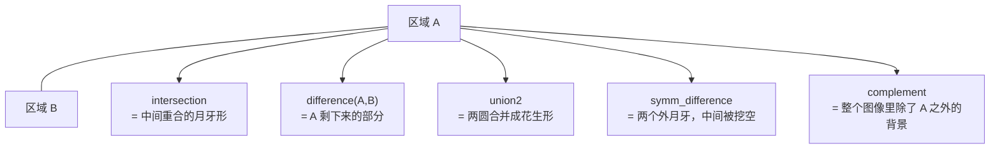

---
tags:
  - Halcon
  - 区域运算
aliases:
  - 区域集合运算
  - 交集 补集 反选 合并
created: 2026-09-16
---

# 02 区域与区域集合运算

> [!abstract] 一句话总结
> 区域（Region）就是"**一堆像素的坐标集合**"，因此可以像集合一样做**交、并、差、补**运算。这些算子只关心"像素在哪"，完全不关心灰度值。

> **源文件：** `note/01交集补集.....hdev`

## 一、Region 的本质

- Region 是**二值化的、无灰度的**对象：要么属于这个区域，要么不属于。
- 它内部记录的是游程（run-length）编码的像素集合，因此可以精确求面积、做集合运算。
- 一个变量里可以装**多个区域**（区域数组），例如 `connection` 的输出 `ConnectedRegions`。此时算子会**逐元素**处理，输出元组个数与输入区域个数一致。

## 二、五个集合运算算子

| 算子 | 数学含义 | 记忆口诀 | 是否有方向性 |
|---|---|---|---|
| `intersection (R1, R2, Out)` | $R_1 \cap R_2$ | **共有**的部分 | 无（可交换） |
| `difference (R1, R2, Out)` | $R_1 - R_2$ | **R1 挖掉 R2** | **有！顺序不能颠倒** |
| `complement (R, Out)` | $\overline{R}$ | **反选**，把没选中的选上 | 无 |
| `union2 (R1, R2, Out)` | $R_1 \cup R_2$ | **两个**区域合并 | 无 |
| `symm_difference (R1, R2, Out)` | $R_1 \oplus R_2$（异或） | 合并后**去掉重合部分** | 无（可交换） |



> [!tip] 三句话记住区别
> 1. **交集**要"两个都算"；**并集**只要"有一个就算"。
> 2. **difference 做减法，谁减谁结果完全不同**：`difference(大圆, 小圆)` = 圆环，`difference(小圆, 大圆)` = 空集。
> 3. **symm_difference 是"并集 − 交集"**，也就是"只在其中一个里面出现"的部分（异或）。

> [!warning] 常见误解
> `complement` 补集是相对于**整幅图像域**（整个图像矩形）取反，而不是相对于"另一个区域"。所以大圆反选后得到的是一个中间带圆孔的矩形，而不是小黑点。
> 源码里对 `symm_difference` 的注释写着"两个区域合并后的区域，与两个区域交集的补集"——**这个描述容易看晕**，直接理解成"异或：只属于 A 或只属于 B 的像素"即可。

## 三、源码逐段解读

```c
* 交集 , 补集 , 反选 , 合并
dev_close_window ()
dev_open_window (0, 0, 512, 512, 'black', WindowHandle)

* 设置显示模式 (显示成轮廓: margin , 显示区域: fill)
dev_set_draw ('fill')

* 手动画两个圆并生成对应的圆区域
draw_circle (WindowHandle, Row, Column, Radius)
gen_circle (Circle, Row, Column, Radius)

draw_circle (WindowHandle, Row1, Column1, Radius1)
gen_circle (Circle1, Row1, Column1, Radius1)

* 交集
intersection (Circle, Circle1, RegionIntersection)
dev_clear_window ()
dev_display (RegionIntersection)

* 补集（减法）：Circle 减去 Circle1
difference (Circle, Circle1, RegionDifference)
dev_clear_window ()
dev_display (RegionDifference)

* 反选：相对于整幅图像取反
complement (Circle, RegionComplement)
dev_clear_window ()
dev_display (RegionComplement)

* 合并两个区域
union2 (Circle, Circle1, RegionUnion)
dev_clear_window ()
dev_display (RegionUnion)

* 对称差：并集 – 交集
symm_difference (Circle, Circle1, RegionDifference1)
dev_clear_window ()
dev_display (RegionDifference1)
```

**`draw_circle` 与 `gen_circle` 的关系**：`draw_circle` 是**交互式**的，它在窗口里让你用鼠标点三下（圆心、圆周），然后把参数**返回**给你；`gen_circle` 才真正**生成**区域对象。所以这两行必须成对出现——这是"人机交互取参"的标准套路。

| 算子 | 用途 | 是否生成区域 |
|---|---|---|
| `draw_circle (WindowHandle, Row, Column, Radius)` | 鼠标交互获取圆心与半径 | 否，只返回参数 |
| `gen_circle (Circle, Row, Column, Radius)` | 用给定参数生成圆区域 | **是** |

## 四、一张图理解五种运算

以两个部分重叠的圆 `A`、`B` 为例：

| 结果区域 | 视觉描述 | 算子 |
|---|---|---|
| 中间那片叶子形 | 两圆重合处 | `intersection (A, B, Out)` |
| A 剩下的月牙 | A 被 B 咬掉一口 | `difference (A, B, Out)` |
| B 剩下的月牙 | B 被 A 咬掉一口 | `difference (B, A, Out)` |
| 花生形 | 两圆粘成一个整体 | `union2 (A, B, Out)` |
| 左右两个月牙 | 中间重合部分被挖掉 | `symm_difference (A, B, Out)` |
| 带圆孔的大矩形 | 整幅图里除 A 外的所有像素 | `complement (A, Out)` |

## 五、同类延伸算子

| 算子 | 说明 |
|---|---|
| `union1 (Regions, Out)` | 把**一整组**区域合并成一个（与 `union2` 的区别见 [[03 二值化与连通域分割]]） |
| `concat_obj (Obj1, Obj2, Out)` | 把两组区域**串起来放进同一个变量**，但**不合并像素**，区域个数是相加的关系 |
| `intersection` / `difference` 的 `_region` 版本 | 用于 XLD 轮廓的集合运算：`union2_closed_contours_xld` 等 |
| `select_obj (Regions, Obj, Index)` | 从区域数组中按序号取出某一个 |

> [!note] `union1` vs `union2` vs `concat_obj`
> - `union2`：合并 **2 个**区域，结果 **1 个**区域。
> - `union1`：合并 **一组**区域，结果 **1 个**区域。
> - `concat_obj`：把两组**拼在一起**，结果区域个数 = 两组个数之和，**像素互不相干**。

## 六、练习建议

1. 把源码里的 `difference (Circle, Circle1, ...)` 反过来写成 `difference (Circle1, Circle, ...)`，观察结果变化，加深"方向性"印象。
2. 用 `dev_set_colored (12)` 代替 `dev_set_color`，同时显示多个运算结果，直观对比。
3. 思考题：如果两个圆**不相交**，`intersection` 的输出是什么？`region` 为空时，后续 `dev_display` 会怎样？—— 空区域不报错，只是什么都不画（可配合 `set_system ('no_object_result', 'true')` 控制空结果行为）。

---
上一步：[[01 Halcon语言基础与图像入门]] · 下一步：[[03 二值化与连通域分割]]
