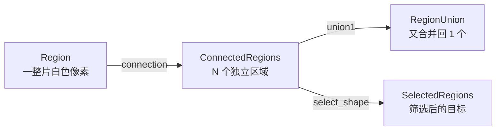

---
tags:
  - Halcon
  - 图像分割
aliases:
  - 二值化
  - connection
  - 连通域
created: 2026-09-16
---

# 03 二值化与连通域分割

> [!abstract] 一句话总结
> **`threshold` 把灰度图变成区域（挑出亮/暗的像素）**，**`connection` 把一大片区域拆成一个个独立物体**，**`union1` 再把它们合回去**。这三步是所有 Blob 分析的地基。

> **源文件：** `note/02合并区域集合.hdev`、`note/03二值化处理.hdev`

## 一、threshold：从 Image 到 Region

```c
threshold (Image, Region, 128, 255)
```

**签名：** `threshold(Image : Region : MinGray, MaxGray : )`

- 选择满足 **`MinGray ≤ 灰度值 ≤ MaxGray`**（闭区间）的所有像素，组成 `Region`。
- 8 位图像灰度范围 **0 ~ 255**：0 是纯黑，255 是纯白。

判断该选哪一段灰度，取决于目标比背景**亮还是暗**：

| 目标特征 | 写法 | 例子 |
|---|---|---|
| 目标比背景**亮**（白物体、反光件） | `threshold (Image, Region, 128, 255)` | 白色曲别针、印刷文字 |
| 目标比背景**暗**（黑物体、划痕） | `threshold (Image, Region, 0, 100)` | 深色金属件、黑色号牌 |
| 只取极暗的瑕疵 | `threshold (Image, Region, 8, 100)` | 木节、暗斑检测 |

> [!warning] threshold 的作用域是"整幅图"
> 它**不区分位置**，所以当图像存在明暗不均（光照梯度）时，一个固定阈值会一边切多、一边切少。解决办法：
> 1. 先做光照补偿（`illuminate`）或形态学背景估计（`mean_image` + `dyn_threshold`）；
> 2. 改用自适应阈值 `binary_threshold (Image, Region, 'max_separability', 'dark', UsedThreshold)`，让 HALCON 自动算 Otsu 阈值。

## 二、connection：把一整块拆成一个个物体

```c
connection (Region, ConnectedRegions)
```

**签名：** `connection(Region : ConnectedRegions : : )`

- **连通性**：默认按 **8 邻域**判断两个像素是否相连（上下左右 + 四个对角），因此对角线接触也算"同一个物体"。
- 输入 1 个区域，输出 **N 个区域**（N = 连通分量个数）。
- 输出的 `ConnectedRegions` 仍然是**一个变量**，只是里面装了 N 个区域，用 `[i]` 索引或 `select_obj` 取其中某一个。



### 为什么必须先 connection

因为**形状类特征只能针对"单个物体"计算**：

- 不 `connection`：`'area'` 是"所有白色像素之和"，算出来是一个巨大的数，没有物理意义。
- `connection` 之后：`'area'` 是"每一个物体的面积"，才能筛"面积在 500~10000 像素的目标"。

> [!tip] 判断依据
> **只要你想用 `'area'`、`'width'`、`'circularity'` 这类"单体形状特征"来筛选，之前就一定要有 `connection`。**

## 三、union1 / union2：合并回去

```c
union1 (ConnectedRegions, RegionUnion)   * 把一整组区域合并成 1 个
union2 (RegionA, RegionB, RegionUnion)   * 把 2 个区域合并成 1 个
```

**签名：** `union1(Region : RegionUnion : : )`

| 场景 | 该用哪个 |
|---|---|
| 已经 `connection` 过，但最后只想要"所有目标的整体外轮廓/整体区域" | `union1` |
| 只要把两个指定区域粘在一起 | `union2` |
| 想把两组区域放在同一个变量里但**不合并像素** | `concat_obj` |

## 四、源码逐段解读

### 4.1 合并区域集合（`02合并区域集合.hdev`）

```c
dev_close_window ()
dev_open_window (0, 0, 512, 512, 'black', WindowHandle)

* 加载图片
read_image (Image, 'printer_chip/printer_chip_01')

* 二值化处理
threshold (Image, Region, 128, 255)

* 分割区域 -> 每个芯片引脚/块变成独立区域
connection (Region, ConnectedRegions)

* 合并区域集合 -> 又变回一整片
union1 (ConnectedRegions, RegionUnion)
dev_clear_window ()
dev_display (RegionUnion)
```

> [!note] 这个例子的意义
> 它演示了 **"分久必合"** 的完整回路：`threshold → connection → union1`。
> 单看结果，`RegionUnion` 和最初的 `Region` **视觉上几乎一样**，区别在于：`Region` 是一整块（内部细节被抹平），`RegionUnion` 是由多个物体合并而成，**区域个数从 N 变回 1**。中间这一步 `connection` 的价值，在于它让你**有机会插进筛选**。

### 4.2 二值化处理与筛选（`03二值化处理.hdev`）

```c
* 二值化处理过滤
read_image (Image, 'audi2')
dev_close_window ()
dev_open_window (0, 0, 512, 512, 'black', WindowHandle)

* 设置显示模式, 显示颜色
dev_set_color ('green')
dev_set_draw ('fill')

* 第一步: 二值化处理
threshold (Image, Regions, 0, 100)
dev_display (Image)
dev_display (Regions)

* 第二步: 分割
connection (Regions, ConnectedRegions)
dev_clear_window ()
dev_display (Image)
dev_display (ConnectedRegions)

* 第三步: 筛选（通过: 面积, 宽度, 高度）
select_shape (ConnectedRegions, SelectedRegions, \
              ['area','width','height'], 'and', [527.98,38.54,54.38], [10454.1,63.89,1000])

* 最终效果
dev_set_color ('pink')
dev_clear_window ()
dev_display (Image)
dev_display (SelectedRegions)
```

这段代码是**教科书式的 Blob 三连**。注意它的调试手法：

1. **每做一步就 `dev_display` 看一次效果**，这是学 HALCON 最有效的习惯；
2. 显示时**先画原图再叠区域**，因为 `dev_set_draw ('fill')` 会用实心色块盖住底图，若顺序反了就什么都看不见；
3. 调参阶段用 `dev_set_color ('green')`、`dev_set_color ('pink')` **换色**，方便区分"分割结果"和"筛选结果"。

具体参数见 [[04 区域特征与 select_shape 筛选]]。

## 五、图像颜色的显示约定（调试期）

| 设置 | 效果 |
|---|---|
| `dev_set_draw ('fill')` | 区域填充实心，适合看形状和面积 |
| `dev_set_draw ('margin')` | 只画区域轮廓（**底图不会被遮挡**），适合看定位精度 |
| `dev_set_color ('green')` | 单色显示，最常用 |
| `dev_set_colored (12)` | 用 12 色循环，适合观察 `connection` 的分割是否合理 |

> [!question] 自检
> 1. `threshold (Image, Region, 0, 100)` 和 `threshold (Image, Region, 100, 255)` 的结果互补吗？—— **互补**（一个取暗、一个取亮，合起来正好是整幅图，边界灰度 100 被两者共有）。
> 2. 为什么 `04套环检测.hdev` 里用 `192 ~ 255` 而不是 `128 ~ 255`？—— 因为背景偏灰（不是纯白），阈值抬高才能只留下真正亮的圆环，见 [[08 实战 套环检测]]。

---
上一步：[[02 区域与区域集合运算]] · 下一步：[[04 区域特征与 select_shape 筛选]]
