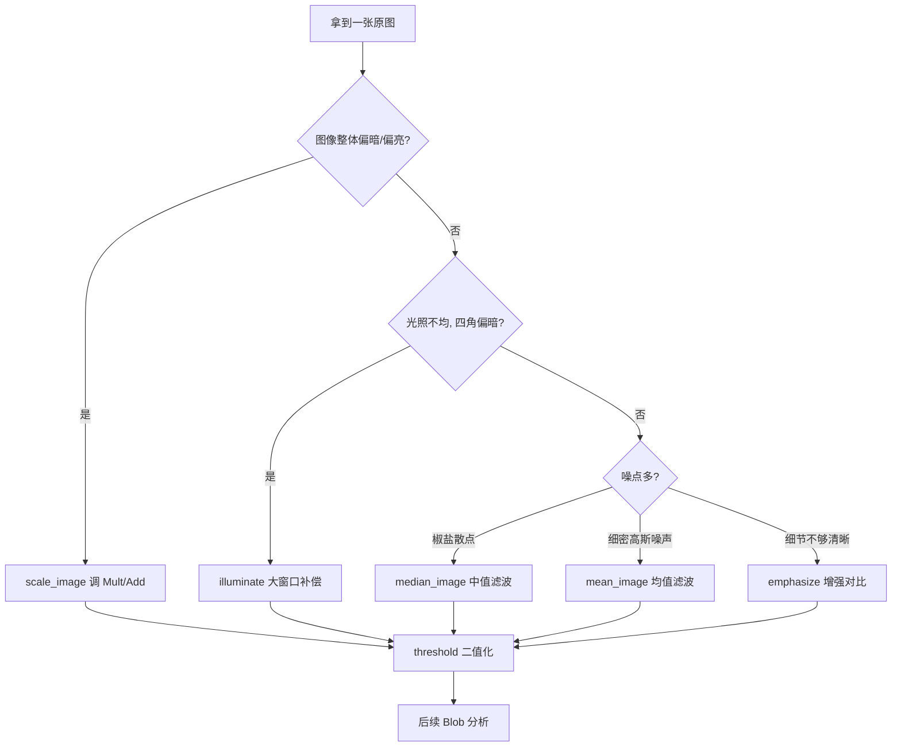

---
tags:
  - Halcon
  - 图像处理
  - 滤波
aliases:
  - 图像预处理
  - 滤波
  - 图像增强
created: 2026-09-16
---

# 05 图像预处理与滤波

> [!abstract] 一句话总结
> 预处理的目的只有两个：**① 让目标与背景的灰度差异更大（增强）**；**② 让噪点更少（滤波）**。做完之后再去做 `threshold`，结果会稳定得多。

> **源文件：** `note/05图像预处理.hdev`

## 一、灰度变换：scale_image 与 sub_image

### 1.1 scale_image：线性拉伸（乘 + 加）

```c
scale_image (Image, ImageScaled, 1, 50)
```

$$g' = \text{Mult} \cdot g + \text{Add}$$

| 参数 | 作用 | 直觉 |
|---|---|---|
| `Mult` | **乘**系数 | `>1` 拉大对比度（亮的更亮、暗的更暗）；`<1` 压缩对比度 |
| `Add` | **加**系数 | `>0` 整体提亮；`<0` 整体压暗 |

> [!tip] 源码参数解读
> `scale_image (Image, ImageScaled, 1, 50)`：乘系数为 1（对比度不变），加系数 50 → **整体提亮 50 个灰度级**。这是"图像太暗，先整体抬亮再看"的典型手法。

### 1.2 sub_image：两图相减（差分）

```c
sub_image (ImageScaled, Image, ImageSub, 1, 0)
```

$$g' = \text{Mult} \cdot (g_1 - g_2) + \text{Add}$$

- **`Mult` 用来把差值放大**（差值通常很小，不放大看不清）；
- **`Add` 用来把结果抬回正区间**，避免出现负数（8 位图像无法表示负值）。

**主要用途：**

| 用途 | 做法 |
|---|---|
| **背景消除 / 光照补偿** | 大核 `mean_image` 得到"背景"，再与原图相减 → 只留下细节 |
| **运动检测 / 缺陷比对** | 标准图与待检图相减，差异处即为异常 |
| **验证一步操作的效果** | 如源码中 `sub_image (ImageScaled, Image, ...)` 把"提亮 50"的效果直接差出来看 |

> [!note] 源码里那两行"看起来没用"的代码
> ```c
> scale_image (Image, ImageScaled, 1, 50)
> sub_image (ImageScaled, Image, ImageSub, 1, 0)
> ```
> 这是在做**实验**：先把图提亮 50 得到 `ImageScaled`，再把 `ImageScaled` 减去原图，得到的 `ImageSub` 应当是一张"灰度恒为 50"的图 —— 用来**验证 `scale_image` 参数理解是否正确**。之后的 `emphasize`、`illuminate` 也都作用在 `ImageSub` 上，属于随手拿来试参数的练习。

## 二、平滑滤波：均值 vs 中值

### 2.1 mean_image：均值滤波

```c
mean_image (Image1, ImageMean, 6, 6)
```

**签名：** `mean_image(Image : ImageMean : MaskWidth, MaskHeight : )`

- 用 `MaskWidth × MaskHeight` 的窗口（这里是 6×6）**取平均**替代中心像素。
- **优点**：平滑效果强，计算快，能明显压低随机噪点。
- **缺点**：**边缘会被模糊**，图像特征（锐利的角、细线）一起被抹掉。

> [!warning] 源码注释的原文
> `*平滑  均值滤波 (可以扫尾去除一些噪点 , 但是会减少图像特征)`
> "减少图像特征"就是这个意思：**均值滤波是无差别的**，它不区分"这是噪声还是这是我要的边"。

### 2.2 median_image：中值滤波

```c
median_image (Image1, ImageMedian, 'circle', 6, 'mirrored')
```

**签名：** `median_image(Image : ImageMedian : MaskType, Radius, Margin : )`

| 参数 | 取值 | 说明 |
|---|---|---|
| `MaskType` | `'circle'` / `'square'` | 掩膜形状，圆掩膜各方向对称性更好 |
| `Radius` | 数值 | 掩膜**半径**（注意这里叫 Radius，不是 Width/Height） |
| `Margin` | `'mirrored'` / `'cyclic'` / `'continued'` / `0` / `255` | **边界外推方式**：镜像 / 循环 / 延长 / 填 0 / 填 255 |

- 用窗口内像素的**中位数**替代中心像素。
- **优点**：**去椒盐噪点（salted noise）能力极强，且能较好保留边缘**。
- **缺点**：比均值慢；对高斯型细密噪声不如均值有效。

### 2.3 对比总结

| | `mean_image` 均值滤波 | `median_image` 中值滤波 |
|---|---|---|
| 计算 | 窗口内取**平均值** | 窗口内取**中位数** |
| 噪声类型 | 高斯噪声、随机噪点 | **椒盐噪声**（黑白散点） |
| 边缘 | **模糊明显** | **保留较好** |
| 速度 | 快 | 慢 |
| 关键参数 | `MaskWidth, MaskHeight` | `MaskType, Radius, Margin` |
| 选谁 | 想让图像"变柔和" | 想"只去噪点、别动边缘" |

> [!tip] 记忆口诀
> **均值"和稀泥"，中值"投票定"**：均值会被一个极端值（一个纯白噪点）拉偏；中值取中间那个值，极端值直接被无视 —— 这就是中值抗椒盐噪点的原因。

## 三、图像增强

### 3.1 emphasize：增强对比度（锐化）

```c
emphasize (ImageSub, ImageEmphasize, 10, 10, 2)
```

**签名：** `emphasize(Image : ImageEmphasize : MaskWidth, MaskHeight, Factor : )`

- 原理：把原图与该图的均值滤波结果相减，将差值**乘以 `Factor`** 后加回原图。
- `MaskWidth, MaskHeight`：估计局部均值的窗口大小（越大越"粗"）。
- `Factor`：**增强强度**，越大对比越强（也越容易出现噪点放大、过曝）。

> [!warning] Factor 别贪大
> 源码注释写的是"**增加对比度（增加亮度）**"，其实 `emphasize` 主要作用是**锐化/提升局部对比**，`Factor = 2` 已经能明显看出效果；调到 5 以上通常会出现"边缘发白的光晕"。

### 3.2 illuminate：光照补偿（提亮暗部）

```c
illuminate (ImageSub, ImageIlluminate, 200, 200, 2)
```

**签名：** `illuminate(Image : ImageIlluminate : MaskWidth, MaskHeight, Factor : )`

- 原理：用**大窗口**均值估计出"背景光照"，然后把**暗的地方提亮**，使整体亮度更均匀。
- 窗口一般要开得**很大**（源码用 `200, 200`），目的是"只抓大范围的光照趋势，不要抓细节"。
- **典型用途**：光照不均、四角偏暗的图像，预处理后再 `threshold`。

### 3.3 三个增强算子怎么选

| 算子 | 一句话 | 参数直觉 |
|---|---|---|
| `emphasize` | 提升**局部对比/锐化细节** | 窗口小（10×10），Factor 2 左右 |
| `illuminate` | 补偿**光照不均**、提亮暗区 | 窗口大（200×200），Factor 2~5 |
| `scale_image` | 全局线性**拉伸/提亮** | `Mult` 管对比，`Add` 管亮度 |

## 四、完整源码解读

```c
* 图像预处理
read_image (Image, 'printer_chip/printer_chip_01')

* 乘以常量, 加减常量 (第一个参数是乘以, 第二个加减)
scale_image (Image, ImageScaled, 1, 50)
* 两张图片相减
sub_image (ImageScaled, Image, ImageSub, 1, 0)

* ---------- 平滑 ----------
read_image (Image1, 'crystal.png')
* 均值滤波 (可以去除一些噪点, 但是会减少图像特征)
mean_image (Image1, ImageMean, 6, 6)
* 中值滤波
median_image (Image1, ImageMedian, 'circle', 6, 'mirrored')

* ---------- 增强 ----------
* 图像增强 (增加对比度)
emphasize (ImageSub, ImageEmphasize, 10, 10, 2)
* 图像增强 (增加亮度)
illuminate (ImageSub, ImageIlluminate, 200, 200, 2)
stop ()

* ---------- 形态学 ----------
read_image (Image2, 'x5.bmp')
threshold (Image2, Region, 128, 255)
dilation_circle (Region, RegionDilation, 3.5)
erosion_circle (Region, RegionErosion, 3.5)
stop ()

read_image (Image3, 'x2.bmp')
threshold (Image3, Region1, 128, 255)
opening_circle (Region1, RegionOpening, 3.5)

read_image (Image4, 'x4.bmp')
threshold (Image4, Region2, 128, 255)
closing_circle (Region2, RegionClosing, 6)

* 形态学调整 一般都是搭配着二值化处理来使用
read_image (Image5, 'wood_knots')
threshold (Image5, Region3, 8, 100)
connection (Region3, ConnectedRegions)
opening_circle (ConnectedRegions, RegionOpening1, 3.5)
select_shape (RegionOpening1, SelectedRegions, 'area', 'and', 50, 500)
dev_clear_window ()
dev_display (Image5)
dev_display (SelectedRegions)
```

> [!note] 注意 `stop ()` 的位置
> 源码用 `stop ()` 把程序切成几段：**每段演示一类预处理手段**，按 F5 运行时会一段段停下，方便对照窗口看效果。这是 HDevelop 里组织"多主题练习"的标准写法。

## 五、配套素材说明

`x2.bmp`、`x4.bmp`、`x5.bmp` 三张图是**同一个零件的三种状态**，正好构成形态学练习的对照素材：

| 素材 | 图像状态 | 用于演示 |
|---|---|---|
| `x2.bmp` | 目标边缘带**细白毛刺**与细小飞点 | `opening_circle` 去毛刺（见 [[06 形态学运算]]） |
| `x4.bmp` | 目标内部混有**黑色小孔洞**（椒盐噪点） | `closing_circle` 填黑点 |
| `x5.bmp` | 干净的理想图（用于对照） | 膨胀 / 腐蚀的基准 |

![[x2_hair_noise.png|260]] ![[x4_black_dots.png|330]] ![[x5_clean.png|260]]

> [!tip] 观察重点
> 对比 `x2` 与 `x5`：`x2` 的白色主体上额外长出许多**细如发丝的白线**（毛刺）——这正是开运算要消除的目标。
> 对比 `x4` 与 `x5`：`x4` 的白色主体里散布着**黑色小点**（孔洞）——这正是闭运算要填补的目标。

## 六、预处理决策流程



> [!question] 自检
> 1. `scale_image (Image, Out, 2, -50)` 的效果是什么？—— 对比度加倍（亮暗差距拉大），同时整体压暗 50；若出现"255 顶格"就是过曝，需调小 `Mult` 或加大 `Add`。
> 2. 为什么 `mean_image` 的窗口参数叫 `MaskWidth, MaskHeight`，而 `median_image` 叫 `Radius`？—— 因为均值用的是**矩形**窗口，中值用的是**圆形**掩膜（`'circle'`），半径比宽高更自然。
> 3. `illuminate` 的窗口为什么开 200×200 这么大？—— 目标是抓**大范围光照趋势**，窗口必须远大于细节尺寸才不会把细节当成光照给"补"掉。

---
上一步：[[04 区域特征与 select_shape 筛选]] · 下一步：[[06 形态学运算]]
