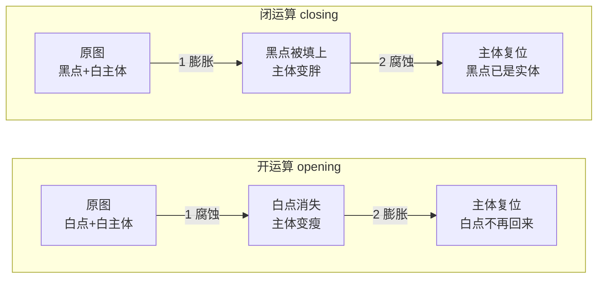
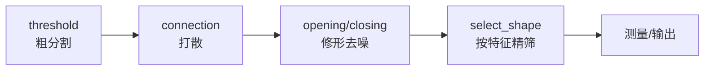

---
tags:
  - Halcon
  - 形态学
aliases:
  - 膨胀 腐蚀 开运算 闭运算
  - 形态学
created: 2026-09-16
---

# 06 形态学运算

> [!abstract] 一句话总结
> 形态学只有四个基础动作：**膨胀（变胖）、腐蚀（变瘦）、开运算（先腐后膨 → 去掉小白点/毛刺）、闭运算（先膨后腐 → 填掉小黑点/裂缝）**。它作用在 **Region** 上，**必须搭配二值化使用**。

> **源文件：** `note/05图像预处理.hdev`（`x2` / `x4` / `x5` / `wood_knots` 四组练习）

## 一、四个基础算子

| 算子 | 签名 | 效果 | 一句话 |
|---|---|---|---|
| `dilation_circle` | `(Region : RegionDilation : Radius : )` | 区域**外扩** Radius 像素 | 目标"长胖" |
| `erosion_circle` | `(Region : RegionErosion : Radius : )` | 区域**内缩** Radius 像素 | 目标"变瘦" |
| `opening_circle` | `(Region : RegionOpening : Radius : )` | 先腐蚀 → 再膨胀 | **去小白点、去毛刺、断开细连接** |
| `closing_circle` | `(Region : RegionClosing : Radius : )` | 先膨胀 → 再腐蚀 | **填小黑点、补裂缝、连接断裂** |

```c
dilation_circle (Region, RegionDilation, 3.5)    * 膨胀，半径 3.5 像素
erosion_circle (Region, RegionErosion, 3.5)      * 腐蚀，半径 3.5 像素
opening_circle (Region1, RegionOpening, 3.5)     * 开运算
closing_circle (Region2, RegionClosing, 6)       * 闭运算
```

> [!tip] Radius 的物理含义
> `Radius` 是**结构元（圆盘）的半径，单位是像素**。它决定了"多小的东西会被消掉/填掉"：
> - 开运算：**凡是宽度小于 2×Radius 的白色结构**都会被腐蚀掉，之后膨胀也回不来 → 这就是"去毛刺"的原理。
> - 闭运算：**凡是宽度小于 2×Radius 的黑色孔洞/缝隙**都会被填上。
>
> 半径越大，去除/填补能力越强，但也越容易把有用特征一起干掉。

## 二、原理示意



> [!warning] 顺序绝对不能记反
> **开运算 = 先腐蚀后膨胀**：先"瘦身"把细小的白东西挤掉，再"长回来"，主体形状基本复原，但**被挤掉的小白点再也长不回来**。
> **闭运算 = 先膨胀后腐蚀**：先"长胖"把小的黑孔糊上，再"瘦回来"，主体形状复原，但**被糊上的黑孔已经变成实体**。
>
> 记忆口诀：**开 → 去掉"白"的小东西；闭 → 去掉"黑"的小东西**。
> 或者记成"**开运算让白的变干净，闭运算让白的变完整**"。

## 三、源码逐段解读

### 3.1 单独演示膨胀与腐蚀

```c
read_image (Image2, 'x5.bmp')
threshold (Image2, Region, 128, 255)          * 二值化，拿到目标区域

dilation_circle (Region, RegionDilation, 3.5) * 膨胀：区域向外扩 3.5 像素
erosion_circle (Region, RegionErosion, 3.5)   * 腐蚀：区域向内缩 3.5 像素
stop ()
```

- 膨胀后**面积变大**，细缝被填、相邻目标可能粘连；
- 腐蚀后**面积变小**，细连接会断开、小目标可能直接消失。

![[x5_clean.png|240]]

### 3.2 开运算：去白毛刺

```c
read_image (Image3, 'x2.bmp')
threshold (Image3, Region1, 128, 255)
opening_circle (Region1, RegionOpening, 3.5)
```

`x2.bmp` 的目标主体边缘带有细白毛刺和孤立小白点，开运算后这些**比 2×3.5 = 7 像素更细**的结构全部消失，主体保持完好。

![[x2_hair_noise.png|240]]

### 3.3 闭运算：填黑点

```c
read_image (Image4, 'x4.bmp')
threshold (Image4, Region2, 128, 255)
closing_circle (Region2, RegionClosing, 6)
```

`x4.bmp` 的白色主体里混着黑色小孔洞（椒盐噪点），闭运算半径取 6（比开运算的 3.5 更大），因为要填的孔洞尺寸更大。

![[x4_black_dots.png|300]]

### 3.4 形态学的真实用法：预处理 + 过滤

```c
* 形态学调整 一般都是搭配着二值化处理来使用
read_image (Image5, 'wood_knots')
threshold (Image5, Region3, 8, 100)              * 1 二值化：木节是暗点，取 8~100
connection (Region3, ConnectedRegions)           * 2 分割成一个个独立候选
opening_circle (ConnectedRegions, RegionOpening1, 3.5)   * 3 开运算：去掉细小毛刺干扰
select_shape (RegionOpening1, SelectedRegions, 'area', 'and', 50, 500)  * 4 按面积筛选
dev_clear_window ()
dev_display (Image5)
dev_display (SelectedRegions)
```

这是**标准工业写法**，顺序值得背下来：



> [!note] 为什么开运算放在 `connection` 之后？
> 从原理上说，开运算放在 `connection` **之前**也可以（结果等价，都是逐区域处理）。放在之后的好处是：**中间可以用 `stop ()` 或 `dev_display` 观察"开了多少东西"，也方便在开运算后立刻接 `select_shape`**。实际项目中两种顺序都常见，关键是理解每一步在做什么。

## 四、同类算子家族

除了圆形结构元，HALCON 还提供矩形与任意结构元版本：

| 家族 | 圆（对称性最好） | 正矩形 | 带角度矩形 |
|---|---|---|---|
| 生成结构元 | `gen_circle` | `gen_rectangle1` | `gen_rectangle2` |
| 膨胀 | `dilation_circle` | `dilation_rectangle1` | `dilation2` |
| 腐蚀 | `erosion_circle` | `erosion_rectangle1` | `erosion2` |
| 开运算 | `opening_circle` | `opening_rectangle1` | `opening` |
| 闭运算 | `closing_circle` | `closing_rectangle1` | `closing` |

其他常用变形：

| 算子 | 作用 |
|---|---|
| `opening` / `closing` | 用**任意结构元**（由 `gen_region_*` 生成）做开/闭运算 |
| `boundary (Region, RegionBorder, 'inner')` | 取区域**边界**（常配合 `select_shape` 的 `'area'` 做细线提取） |
| `skeleton (Region, Skeleton)` | 提取**骨架**（中轴线），用于细长物体 |
| `fill_up (Region, RegionFillUp)` | **填充区域内的所有孔洞**（比闭运算更彻底，不看孔的大小） |
| `fill_up_shape` | 按孔的形状特征填充 |
| `shape_trans (Region, Out, 'convex')` | 形状变换：`'convex'` 凸包、`'ellipse'` 等效椭圆、`'rectangle1/2'` 外接矩形 |

> [!tip] `fill_up` 与 `closing_circle` 的区别
> `closing_circle` 只能填**小于结构元尺寸**的孔；`fill_up` **无视孔的大小，把所有被包围的孔全填上**。判断"零件内部应该实心"时，`fill_up` 往往更省事。

## 五、参数速查与经验值

| 场景 | 建议 |
|---|---|
| 去除孤立小噪点 | `opening_circle`，Radius 略大于噪点半径（如 1.5 ~ 3.5） |
| 去除细毛刺 | `opening_circle`，Radius 取毛刺宽度的一半以上 |
| 填补小孔洞 | `closing_circle`，Radius 取孔洞半径的一半以上 |
| 把断开的物体连起来 | `closing_circle`，Radius 取断裂间隙的一半以上 |
| 需要精确保留尺寸 | **慎用形态学**，它会改变面积；改用 `fill_up` 或直接筛选 |

> [!tip] 上表的半径值只是"起点"，可以标定得更准
> 圆盘结构元下 `erode` / `dilate` 等价于**距离阈值**，所以**缺陷的内切圆半径就是 `Radius` 的理论下限**。
> 本篇第 3.2 / 3.3 节用的 `3.5`（`x2.bmp`）与 `6`（`x4.bmp`）属"宁大勿小"的经验值 ——
> 实测这两张图分别只需 `1` 与 `4.5`，半径取大会白白多削主体、还会蚕食字本身的环孔。
> 完整标定流程与实测数据见 [[13 形态学调整 结构元半径标定]]。

> [!danger] 形态学会改变面积
> 膨胀/腐蚀/开/闭都会**改变区域的形状与面积**。如果后续要测面积、直径、圆度，务必：
> 1. 形态学只用于"去噪/修形"，**测量在修形后的区域上做**（此时测的是修形后的量）；
> 2. 若必须测原图尺寸，则**不要在测量链路上用形态学**，改用 `select_shape` 直接剔除噪点。

## 六、自检

> [!question]
> 1. 为什么开运算能去毛刺，腐蚀却不能？—— 腐蚀能去掉毛刺，但会**让主体整体变瘦**；开运算在腐蚀后再膨胀，**主体恢复原尺寸**，毛刺却回不来。
> 2. 想要"忽略小孔、只保留大孔"该怎么写？—— 闭运算用小半径填掉小孔，剩下的大孔保留；或者用 `select_shape` 的 `'holes_num'` / `'area_holes'` 筛选。
> 3. `dilation_circle (Region, Out, 10)` 之后再 `erosion_circle (Out, Out2, 10)`，结果和 `closing_circle (Region, Out2, 10)` 一样吗？—— **等价**。这就是闭运算的定义。

---
上一步：[[05 图像预处理与滤波]] · 下一步：[[07 区域测量与结果可视化]] · 深入：[[13 形态学调整 结构元半径标定]]
