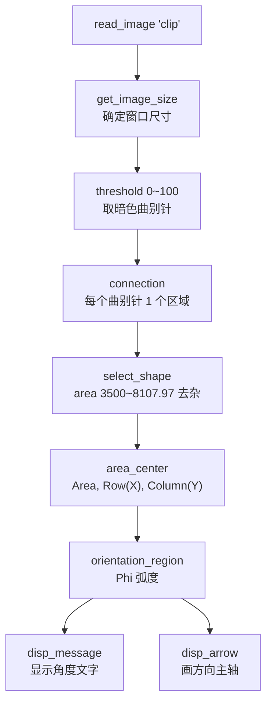

---
tags:
  - Halcon
  - 实战
  - 角度测量
aliases:
  - 曲别针练习
  - clip.hdev
created: 2026-09-16
---

# 09 实战 曲别针计数与角度

> [!abstract] 一句话总结
> 对 HALCON 自带示例图 `clip`（曲别针）做完整的 Blob 分析：`threshold → connection → select_shape → area_center → orientation_region`，最后用 `disp_arrow` 把每个曲别针的**方向主轴**画出来。

> **源文件：** `note/05曲别针练习.hdev`
> **素材：** HALCON 自带示例图 `clip`（`read_image (Image, 'clip')` 直接读，无需外部文件）

## 一、素材与目标

- 图像内容：白色背景上散落若干**曲别针**，曲别针比背景**暗**。
- 任务：① 数出个数；② 求出每个曲别针的面积；③ 求出每个曲别针的**摆放角度**并可视化。

## 二、完整源码

```c
read_image (Image, 'clip')
* 获取图片大小
get_image_size (Image, Width, Height)
dev_close_window ()
dev_open_window (0, 0, Width, Height, 'black', WindowHandle)
dev_display (Image)

* 二值化处理（曲别针比背景暗）
threshold (Image, Region, 0, 100)

* 分割
connection (Region, ConnectedRegions)

* 筛选（按面积）
select_shape (ConnectedRegions, SelectedRegions, 'area', 'and', 3500, 8107.97)

* 看效果
dev_set_color ('blue')
dev_clear_window ()
dev_display (Image)
dev_display (SelectedRegions)

* 获取坐标和面积
area_center (SelectedRegions, Area, X, Y)

* 挨个显示面积（源码中注释掉了，可解开观察）
*for Index := 0 to |Area| -1 by 1
*    dev_disp_text (Area[Index], 'window', X[Index], Y[Index], 'black', [], [])
*endfor

* 获取角度
orientation_region (SelectedRegions, Phi)

* 显示角度
disp_message (WindowHandle, deg(Phi)$'3.2f'+'deg', 'window', X, Y, 'black', 'false')

* 设置线宽
dev_set_line_width (3)
dev_set_color ('yellow')

* 画箭头：从质心沿主轴方向画长 100 的箭头
disp_arrow (WindowHandle, X, Y, X-100*sin(Phi), Y+100*cos(Phi), 3)
```

## 三、流程拆解



### 3.1 阈值 0~100 的选取

曲别针在白色（≈255）背景上是**暗**的，所以取低灰度段 `0 ~ 100`。这个区间把曲别针本体和它在白背景上的**浅灰阴影**都包含进来了（阴影略亮，仍落在 100 以内），能拿到更完整的轮廓。

> [!tip] 判断"取暗"还是"取亮"
> 把鼠标放在图像上读灰度，或者干脆两种都跑一遍看结果。**目标比背景暗 → 取低段；目标比背景亮 → 取高段。**

### 3.2 面积筛选 3500 ~ 8107.97

| 值 | 含义 |
|---|---|
| 下限 3500 | 剔除粘连产生的**小碎片**、二值化残留的**孤立噪点** |
| 上限 8107.97 | 剔除**两个曲别针粘连**形成的过大区域（约 2×4000） |

> [!note] 8107.97 这个数字
> 带小数说明是**实测值**。注意到上限约等于下限的 **2.3 倍**，这是典型的"**防止两个目标粘连被当成一个**"的设值思路：如果一个区域明显比单个目标大，就说明粘了，宁可丢掉也不要误检。

### 3.3 area_center 与坐标顺序

```c
area_center (SelectedRegions, Area, X, Y)
```

- 真实输出顺序是 **`Area, Row, Column`**，所以变量 `X` 里装的是 **Row**，`Y` 里装的是 **Column**。
- 后面 `disp_arrow (..., X, Y, ...)` 能正确绘制，是因为 `disp_arrow` 的前两个坐标参数也是 **(Row, Column)**，顺序刚好对上。
- 若某处按 (x, y) 的习惯去用这两个变量，就会**画反**。

### 3.4 orientation_region 与角度显示

```c
orientation_region (SelectedRegions, Phi)
disp_message (WindowHandle, deg(Phi)$'3.2f'+'deg', 'window', X, Y, 'black', 'false')
```

- `Phi` 单位是**弧度**，范围 **−π ≤ Phi < π**（≈ −180° ~ 180°）。
- `deg (Phi)` 转成角度，`$'3.2f'` 保留 2 位小数，`+'deg'` 拼上单位。
- 因为 `Phi` 是**元组**，`deg(Phi)$'3.2f'` 得到的是**字符串元组**，`disp_message` 会**自动逐个显示**，不需要写 `for` 循环 —— 这是 HALCON "元组即批量"思想的一个漂亮体现。

> [!warning] 同一方向可能有两个角度值
> `orientation_region` 基于等效椭圆主轴，且用"离质心最远的轮廓点的列坐标"来决定方向正负。因此**物理上平行的两个区域可能一个返回 `18°`、另一个返回 `−174.8°`**（相差 180°）。
> 如果要用角度做**判断**（而不只是显示），务必先归一化，例如：
> ```c
> PhiNorm := Phi
> if (PhiNorm < 0)
>     PhiNorm := PhiNorm + rad(180)
> endif
> ```
> 或者直接改用 `'rect2_phi'`（最小外接矩形方向）等取值范围受限的特征。

### 3.5 画方向主轴

```c
dev_set_line_width (3)
dev_set_color ('yellow')
disp_arrow (WindowHandle, X, Y, X-100*sin(Phi), Y+100*cos(Phi), 3)
```

终点坐标的推导：

$$
\begin{cases}
\text{Column}_2 = \text{Column}_1 + L\cos\Phi & \Rightarrow Y + 100\cos\Phi \\
\text{Row}_2 = \text{Row}_1 - L\sin\Phi & \Rightarrow X - 100\sin\Phi
\end{cases}
$$

> [!tip] 记忆
> **Column 跟 `cos` 同向（正号），Row 跟 `sin` 反向（负号）**。原因是图像 Row 轴向下，而角度按数学惯例（y 向上、逆时针为正）定义。
>
> 这与 HALCON 官方示例 `clip.hdev` 完全一致：
> ```c
> Length := 80
> disp_arrow (WindowID, Row, Column, Row - Length * sin(Phi), Column + Length * cos(Phi), 4)
> ```

## 四、调试技巧

| 技巧 | 说明 |
|---|---|
| 先显示"分割结果"，再显示"筛选结果" | 用 `dev_set_color` 换色（如先 `'green'` 后 `'blue'`），并分别 `dev_clear_window` 重画，才能分辨筛选掉了哪些 |
| 用 `dev_set_draw ('margin')` 代替 `'fill'` | 轮廓模式不遮挡底图，方便确认区域是否贴合零件边界 |
| 逐个打印特征值 | 把源码中被注释掉的 `for` 循环解开，或在 HDevelop 变量窗口直接查看 `Area` / `Phi` 元组 |
| 用 `dev_set_colored (12)` | 一次性给所有区域上不同颜色，快速检查 `connection` 分割是否正确 |

## 五、与官方示例 `clip.hdev` 的对比

| | 本练习 | HALCON 官方 `clip.hdev` |
|---|---|---|
| 二值化 | `threshold (Image, Region, 0, 100)` 手动定阈值 | `binary_threshold (Clip, Dark, 'max_separability', 'dark', UsedThreshold)` 自动 Otsu |
| 窗口 | 与图像等大 | `Width/2, Height/2` 缩小显示 |
| 箭头长度 | 100 | 80，且用变量 `Length` |
| 文字 | `disp_message` 显示角度 | `disp_message` 显示角度，位置 `Column - 100` |
| 额外内容 | —— | `dev_update_window ('off')` 提速、`set_display_font` 设字体、`disp_continue_message` 提示继续 |

> [!tip] 建议自己动手补上的三行
> ```c
> dev_update_window ('off')                              * 开头：关闭自动刷新，运行更快
> set_display_font (WindowHandle, 14, 'mono', 'true', 'false')   * 设字体，文字更清晰
> dev_update_window ('on')                               * 结尾：恢复刷新
> ```
> `binary_threshold` 的自动阈值写法也值得掌握：
> ```c
> binary_threshold (Image, Region, 'max_separability', 'dark', UsedThreshold)
> * 'max_separability' = Otsu 最大类间方差法
> * 'dark' = 提取暗目标（'light' 则提取亮目标）
> * UsedThreshold 输出实际使用的阈值，调试时可显示出来
> ```

## 六、自检

> [!question]
> 1. 为什么 `disp_message` 不用 `for` 循环也能把 N 个角度全显示出来？—— 因为 `deg(Phi)$'3.2f'` 是**字符串元组**，`disp_message` 对元组输入会逐元素绘制。
> 2. `select_shape` 的面积上限为什么设在"约两倍目标面积"？—— 防止两个零件粘连后被当成一个而漏检，宁可丢掉也不误检。
> 3. 如果曲别针是**亮**的、背景是**暗**的，代码要改哪两处？—— `threshold` 改成高灰度段（如 `128, 255`），以及后续显示颜色可以不变（颜色只影响显示，不影响数据）。

---
上一步：[[08 实战 套环检测]] · 下一步：[[10 算子速查表]]
