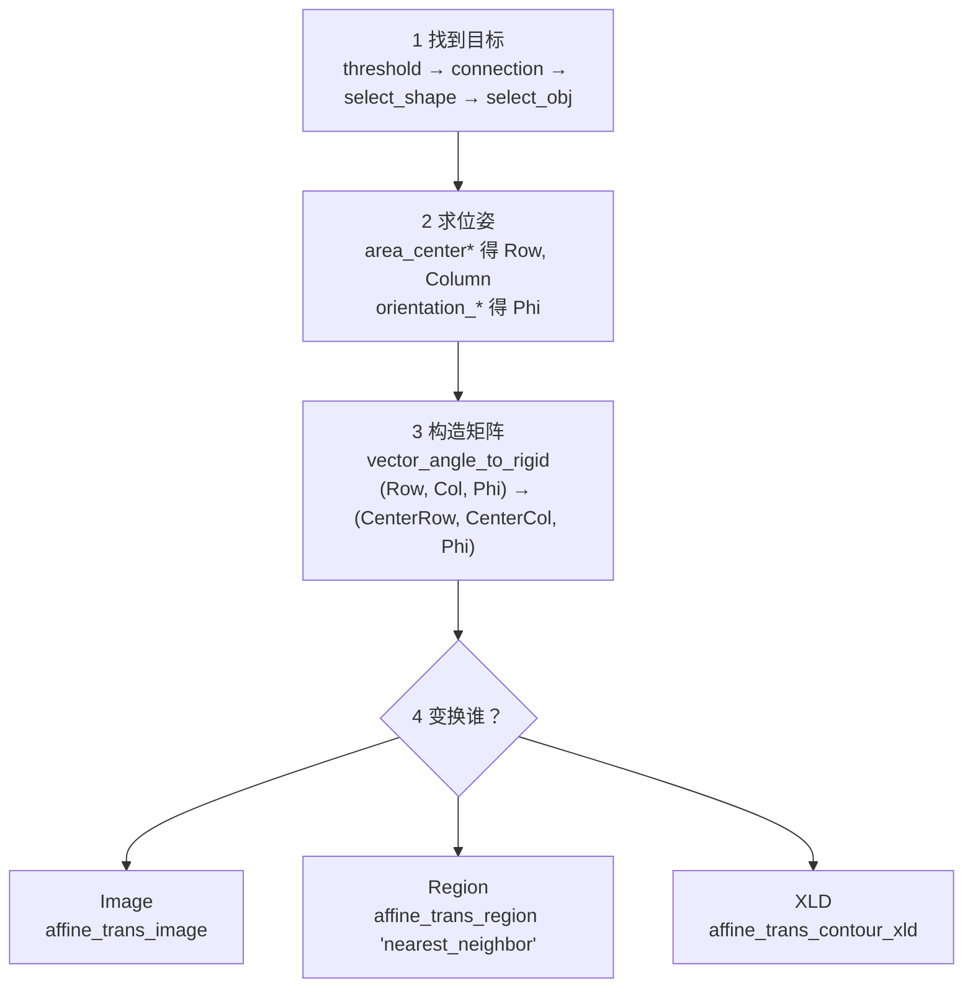
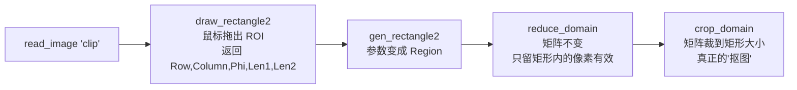

---
tags:
  - Halcon
  - 仿射变换
  - 实战
  - 抠图
aliases:
  - 轮廓仿射变换
  - 区域仿射变换
  - ROI 抠图
created: 2026-09-16
---

# 12 仿射变换实战 区域轮廓与抠图

> [!abstract] 一句话总结
> 同一个 `HomMat2D`，可以作用在 **Image / Region / XLD** 三种对象上，分别用 `affine_trans_image` / `affine_trans_region` / `affine_trans_contour_xld`。实战里最常用的一招叫"**搬正 + 居中**"：先算目标的质心和主轴角，再用 `vector_angle_to_rigid` 把它挪到画面中心；最后再加一节 `reduce_domain + crop_domain` 把 ROI **抠出来当模板**。

> **源文件（本轮新增）：**
> - `note/仿射变换/04对轮廓进行仿射变换.hdev`
> - `note/仿射变换/05对轮廓进行仿射变换.hdev`
> - `note/仿射变换/06对区域进行仿射变换.hdev`
> - `note/仿射变换/07抠图.hdev`
>
> **素材：** HALCON 自带示例图 `printer_chip/printer_chip_01`、`clip`

## 一、同一个矩阵，三种对象

矩阵的构造方式和 `[[11 仿射变换矩阵与图像变换]]` 里完全一样，区别只在"用哪个算子把矩阵作用出去"：

| 变换对象 | 算子 | 控制参数 | 特点 / 代价 |
|---|---|---|---|
| **Image** | `affine_trans_image (Image, Out, HomMat2D, Interpolation, AdaptImageSize)` | 插值方式、是否自适应尺寸 | 要**重采样灰度**，最慢；会引入插值误差 |
| **Region** | `affine_trans_region (Region, Out, HomMat2D, Interpolate)` | `'nearest_neighbor'` / `'constant'` | 只搬"哪些像素属于我"，**无灰度**；`'constant'` 会让边界更平滑但慢很多 |
| **XLD 轮廓** | `affine_trans_contour_xld (Contours, Out, HomMat2D)` | 无 | **只搬点坐标**，最快、最干净，亚像素精度不丢 |
| **XLD 多边形** | `affine_trans_polygon_xld (Polygons, Out, HomMat2D)` | 无 | 同上 |

> [!tip] 选哪个？
> - **只关心形状 / 位置**（测量、对齐、画示意图）→ 用 **XLD**，最省最准。
> - **后续还要按灰度算东西**（模板匹配、OCR、灰度特征）→ 用 **Image**。
> - **只要一块二值掩膜**（后续做区域运算、形态学）→ 用 **Region**。
>
> 三者可以互相转换：`gen_contour_region_xld`（区域→轮廓）、`gen_region_contour_xld`（轮廓→区域）、`reduce_domain`（区域→图像的有效范围）。

## 二、区域怎么变成轮廓：`gen_contour_region_xld`

```c
gen_contour_region_xld (Regions, Contours, Mode)
```

把 Region 的边界抽成 XLD 轮廓。每个连通域生成一条**闭合**轮廓。`Mode` 有三档：

| `Mode` | 含义 |
|---|---|
| `'border'`（**默认**） | 用边界像素的**外边界**当轮廓点。轮廓会"胖一圈"，长度最大 |
| `'center'` | 用边界像素的**中心**当轮廓点。更接近区域的真实中心线，长度明显更短 |
| `'border_holes'` | 在 `'border'` 基础上，**把所有孔洞的轮廓也一起生成** |

> [!warning] `'border'` 和 `'center'` 量出来的周长差很多
> 官方用一个小例子说明：对于**斜着走**的边界，`'border'` 会拆成两段长度各为 1 的线段，而 `'center'` 只用一段长度 $\sqrt{2}\approx1.414$ 的线段。
> 所以 `length_xld` 的周长值、乃至 `area_center_xld` 的面积值，都会因为 `Mode` 不同而不同。
> **要跟"像素级周长"对比就用 `'border'`；要细一点的几何量就用 `'center'`；别混着比。**

## 三、轮廓的特征：`area_center_xld` / `orientation_xld`

```c
area_center_xld (XLD, Area, Row, Column, PointOrder)
orientation_xld (XLD, Phi)
```

注意 `area_center_xld` **多了一个输出 `PointOrder`**，用于告诉你轮廓点沿边界的绕行方向：

| `PointOrder` | 含义 |
|---|---|
| `'positive'` | 点按**逆时针**（数学正向）排列 |
| `'negative'` | 点按顺时针排列 |

> [!note] 和区域版算子的对应关系
> | 区域（Region） | 轮廓（XLD） | 输出 |
> |---|---|---|
> | `area_center` | `area_center_xld` | `Area, Row, Column`（+ `PointOrder`） |
> | `orientation_region` | `orientation_xld` | `Phi`（**弧度**，−π ≤ Φ < π） |
> | `smallest_rectangle2` | `smallest_rectangle2_xld` | `Row, Column, Phi, Len1, Len2` |
>
> `area_center_xld` 是用**格林公式**直接在轮廓点上积分算面积和质心的，**不会**先栅格化成一个区域 —— 所以它的精度是**亚像素**的，比 `area_center` 更准。

> [!danger] `area_center_xld` 的前提：轮廓必须能围出一块"不自交"的区域
> 官方明确说明：轮廓（或折线）必须能唯一围出一片区域，**不能自交**。如果是开轮廓，算子会**自动帮你闭合**，而自动闭合有可能造成自交，结果就不可信了。
> 需要检查时用 `test_self_intersection_xld`；如果轮廓本身自交，只想求"点集的中心"，改用 `area_center_points_xld`。

## 四、黄金套路：把目标搬正 + 搬到画面中心

这四份练习（04 / 05 / 06）本质上是**同一个套路**，只是换对象：



**为什么第 3 步"起点角度和终点角度写同一个 `Phi`"？**

因为 `vector_angle_to_rigid` 的效果是：

$$
p' = R(\text{Angle}_2-\text{Angle}_1)\cdot\bigl(p - p_1\bigr) + p_2
$$

当 $\text{Angle}_2=\text{Angle}_1$ 时 $R(0)=I$，变换退化成**纯平移** $p' = p + (p_2-p_1)$ —— 也就是"把目标的质心平移到画面中心，姿态保持不变"。这正是"居中"想要的效果。

> [!tip] 想同时"转正"怎么办？
> 把第 6 个参数写成你想要的角度。例如让主轴统一朝上（$-90°$）：
> ```c
> vector_angle_to_rigid (Row, Column, Phi, CenterRow, CenterCol, rad(-90), HomMat2D)
> ```
> 这时变换就同时包含了"旋转到 -90°"和"平移到中心"两件事 —— 一句话搞定，不用手拼两个矩阵。

## 五、逐文件解读

### 5.1 `04对轮廓进行仿射变换.hdev` —— 轮廓版"居中"

```c
read_image (Image, 'printer_chip/printer_chip_01')

* ① Blob 主线：分出目标
threshold (Image, Region, 128, 255)
connection (Region, ConnectedRegions)
select_shape (ConnectedRegions, SelectedRegions, 'area', 'and', 27745.5, 30491)

dev_clear_window ()
dev_display (Image)
dev_display (SelectedRegions)
stop ()                                  * 断点①：看筛选结果

select_obj (SelectedRegions, ObjectSelected, 1)   * 第 1 个（序号从 1 开始）
dev_clear_window ()
dev_display (Image)
dev_display (ObjectSelected)
stop ()                                  * 断点②：看单个目标

gen_contour_region_xld (ObjectSelected, NewXLD, 'border')   * ② 区域 → 轮廓
dev_clear_window ()
dev_set_line_width (3)
dev_display (Image)
dev_display (NewXLD)
stop ()                                  * 断点③：看轮廓叠在原图上

area_center_xld (NewXLD, Area, Row, Column, PointOrder)     * ③ 求位姿
orientation_xld (NewXLD, Phi)
get_image_size (Image, Width, Height)

vector_angle_to_rigid (Row, Column, Phi,  Height/2, Width/2, Phi, HomMat2D)   * ④ 构造矩阵
affine_trans_contour_xld (NewXLD, ContoursAffineTrans, HomMat2D)             * ⑤ 变换轮廓

dev_clear_window ()
dev_set_line_width (3)
dev_display (Image)
dev_display (ContoursAffineTrans)        * 轮廓被搬到画面中心，姿态不变
stop ()                                  * 断点④
```

**要点：**

1. **`Height/2, Width/2` 这个顺序是对的。** 目标点要按 `(Row, Column)` 传，而 Row 对应"高度"，所以是 `Height/2` 在前、`Width/2` 在后。`get_image_size` 的输出顺序是 `(Width, Height)`，**和坐标顺序正好相反** —— 这一步最容易顺手写反。

2. **`stop ()` 是学习利器。** 它在程序里插一个断点，HDevelop 里按 `F6` 单步、`F5` 继续跑到底。每放一个 `stop()` 就相当于给流程拍一张快照，配合 `dev_clear_window + dev_display` 就能"看见"每一步变了什么。**这是理解 HALCON 顺序执行模型最有效的手段。**

3. **`select_shape` 的面积区间 `27745.5 ~ 30491`** 上限/下限 ≈ **1.10**，只隔了 10% —— 这不是"去噪"式的粗筛（那种上下限会差几十倍），而是**精确锁定某一类尺寸固定的目标**。下限带 `.5` 说明是**实测调出来**的值：把各个连通域的面积打印一遍，取目标那一档的上下沿。

4. **换个方式看效果**：`dev_set_draw ('margin')` 可以让区域只描边，不遮住底图；`dev_set_colored (12)` 能给所有连通域上不同颜色，快速检查 `connection` 分得对不对。

### 5.2 `05对轮廓进行仿射变换.hdev` —— 造一个多边形，缩小到一半

这份练习不读图，**用代码直接"造"一个多边形**，避免依赖素材：

```c
dev_close_window ()
dev_open_window (0, 0, 512, 512, 'black', WindowHandle)

* ① 用两组坐标点造一个填充的多边形区域（注意：先 Row 后 Column！）
gen_region_polygon_filled (Region, [100,50,50,100,300,300,300,100], \
                                   [50,100,200,400,400,200,50,50])

gen_contour_region_xld (Region, Contours, 'border')        * ② 转成轮廓
area_center_xld (Contours, Area, Row, Column, PointOrder)  * ③ 求质心
orientation_xld (Contours, Phi)                            *    求主轴角

vector_angle_to_rigid (Row, Column, Phi, 512/2, 512/2, Phi, HomMat2D)   * ④ 平移到画面中心
hom_mat2d_scale (HomMat2D, 0.5, 0.5, Row, Column, HomMat2DScale)        * ⑤ 再缩 0.5 ← 有坑
affine_trans_contour_xld (Contours, ContoursAffineTrans, HomMat2DScale) * ⑥ 变换

dev_clear_window ()
dev_display (ContoursAffineTrans)
```

**`gen_region_polygon_filled` 的签名是 `(Region : : Row, Column : )`** —— 第一个元组是行、第二个是列，顺序不能反。源码里用 `\` 续行符把两组坐标分开写，可读性更好。

> [!danger] 第 ⑤ 行的"固定点"写错了 —— 这是一个非常好用的顺序坑
> 作者的注释写的是"**把这块区域缩小 0.5 并放到屏幕中间**"，先居中、再原地缩小。但按 `[[11 仿射变换矩阵与图像变换]]` 里说的"**先写的先作用**"规则：
> - 第 ④ 步的平移**先**发生 → 质心已经被搬到 $(256,256)$；
> - 第 ⑤ 步的缩放**后**发生，它的固定点 `(Row, Column)` 是在**全局坐标系**下解释的，而那里的 `(Row, Column)` 是**原来**的质心位置，不是画面中心。
>
> 结果就是：**缩放不是原地发生的，图形被拽向了原来的质心方向。** 算一下最终质心落在哪：
>
> $$c'' = f + 0.5\,(c'-f),\quad f=(\text{Row},\text{Column}),\ c'=(256,256)$$
>
> $$c'' = \bigl(128+\tfrac{\text{Row}}{2},\ 128+\tfrac{\text{Column}}{2}\bigr)$$
>
> 用源码里那 8 个顶点实测（格林公式复算）：
>
> | 量 | 值 |
> |---|---|
> | 多边形面积 `Area` | **81250.0** px² |
> | 质心 `(Row, Column)` | **(183.33, 220.77)** |
> | `PointOrder` | `'positive'`（逆时针） |
> | 居中后（第④步结束）质心 | (256.00, 256.00) ✅ |
> | **实际最终质心** | **(219.67, 238.38)** ❌ |
> | 偏离画面中心 | Row 方向 **36.33 px**、Column 方向 **17.62 px** |
>
> **修法**：想让它在画面中心原地缩小，固定点应该写居中**之后**的位置：
> ```c
> hom_mat2d_scale (HomMat2D, 0.5, 0.5, 512/2, 512/2, HomMat2DScale)
> ```
> 或者干脆把顺序倒过来 —— 先缩放、再平移居中：
> ```c
> hom_mat2d_scale (HomMat2DIdentity, 0.5, 0.5, Row, Column, HomMat2DScale)  * 先绕原质心缩小
> hom_mat2d_translate (HomMat2DScale, 512/2-Row, 512/2-Column, HomMat2D)   * 再平移到中心
> ```
> **这个坑的本质是：`hom_mat2d_*` 里的固定点是"当前坐标系"下的点，而不是"原始图像"下的点。** 每次叠加操作之前，都要先问自己一句"现在这个点在哪儿"。

> [!note] `512/2` 能得 256，但 `Width/3` 会截断
> HALCON 的两个整数相除是**整数除法**：`512/2 = 256` 没问题（整除），但 `512/3 = 170`（小数部分被丢掉）。做坐标计算时写成 `512/2.0`、`Width/3.0` 更安全 —— 只要有一个是浮点数，结果就是浮点数。

### 5.3 `06对区域进行仿射变换.hdev` —— 区域版"居中"

```c
read_image (Image, 'printer_chip/printer_chip_01')
threshold (Image, Region, 128, 255)
connection (Region, ConnectedRegions)
select_shape (ConnectedRegions, SelectedRegions, 'area', 'and', 23046.5, 31388.6)
select_obj (SelectedRegions, ObjectSelected, 1)

dev_clear_window ()
dev_display (Image)
dev_display (ObjectSelected)
stop ()

area_center (ObjectSelected, Area, Row, Column)     * 目标质心
orientation_region (ObjectSelected, Phi)            * 目标主轴角
area_center (Image, Area1, Row1, Column1)           * 整幅图的中心（见下方提示）

vector_angle_to_rigid (Row, Column, Phi, Row1, Column1, Phi, HomMat2D)
affine_trans_region (ObjectSelected, RegionAffineTrans, HomMat2D, 'nearest_neighbor')

dev_clear_window ()
dev_display (Image)
dev_display (ObjectSelected)
dev_display (RegionAffineTrans)     * 原位置(实心) + 新位置 一起显示，方便对比
```

和 04 的差别只有三处：

| | 04（轮廓） | 06（区域） |
|---|---|---|
| 取特征 | `area_center_xld` / `orientation_xld` | `area_center` / `orientation_region` |
| 变换算子 | `affine_trans_contour_xld` | `affine_trans_region (..., 'nearest_neighbor')` |
| 面积区间 | `27745.5 ~ 30491` | `23046.5 ~ 31388.6` |

> [!note] `area_center (Image, Area1, Row1, Column1)` 的含义
> 第二个 `area_center` 传的是 **Image**（不是 Region），此时 HALCON 按图像的 **domain** 来算 —— 默认 domain 就是**整幅矩形**，所以 `(Row1, Column1)` 拿到的就是**整幅图的中心**。
> 官方签名要求的是 `region`，所以这种写法能跑但不够"标准"。等价的规范写法：
> ```c
> get_domain (Image, Domain)
> area_center (Domain, Area1, Row1, Column1)
> ```
> 或者直接用尺寸算（更快、也更能看出 (Row, Column) 顺序）：
> ```c
> get_image_size (Image, Width, Height)
> Row1 := Height/2.0
> Column1 := Width/2.0
> ```

> [!warning] `affine_trans_region` 的 0.5 像素差 —— 为什么"绕自己质心转"会差一点
> 官方在 `affine_trans_region` 的文档里专门提醒：它**不使用 HALCON 标准坐标系**（原点在左上角像素的**中心**），而是用 `affine_trans_pixel` 那套坐标系（原点在左上角像素的**外角**）。
> 而 `area_center` / `area_center_xld` 返回的坐标是**标准坐标系**下的。两者差 $(\tfrac{1}{2},\tfrac{1}{2})$。
>
> 后果：**"算出质心 → 绕这个质心旋转"得到的区域，不会精确压在原区域上**，会错开约半个像素。做**亚像素对位**时必须补偿，官方给的写法是：
> ```c
> hom_mat2d_translate (HomMat2D, 0.5, 0.5, HomMat2DTmp)                  * 全局坐标系：+0.5
> hom_mat2d_translate_local (HomMat2DTmp, -0.5, -0.5, HomMat2DAdapted)   * 局部坐标系：-0.5
> affine_trans_region (Region, RegionAffineTrans, HomMat2DAdapted, 'nearest_neighbor')
> ```
> 它的含义可以这样理解：**输入点坐标先减去 0.5（换到像素坐标系）→ 做变换 → 输出点坐标再加回 0.5（换回标准坐标系）**，两套坐标系就此对齐。
> `hom_mat2d_translate_local` 和 `hom_mat2d_translate` 的区别正是"局部坐标系 vs 全局坐标系" —— 也就是 `[[11 仿射变换矩阵与图像变换]]` 里说的"左乘还是右乘"。
> 只是看效果时这点误差肉眼看不出来；**要精确对位时它是真凶。**

> [!tip] `'nearest_neighbor'` 还是 `'constant'`？
> `affine_trans_region` 只有这两个选择。**默认就是 `'nearest_neighbor'`，绝大多数情况用它。**
> `'constant'` 会在变换时做内部插值，**放大区域时边界更平滑**，但运行时间"急剧增加"（官方用词：the runtime increases drastically）。区域是二值掩膜，本来也没有灰度值得插，除非确实需要平滑边界，否则没必要开。

### 5.4 `07抠图.hdev` —— ROI 抠出来当模板

```c
read_image (Image, 'clip')
dev_close_window ()
get_image_size (Image, Width, Height)
dev_open_window (30, 300, Width/1.5, Height/1.5, 'black', WindowHandle)
dev_display (Image)

dev_set_draw ('margin')            * 区域只画轮廓，不遮住底图
dev_set_line_width (3)             * 线画粗点，看得清

draw_rectangle2 (WindowHandle, Row, Column, Phi, Length1, Length2)   * ① 鼠标交互画 ROI
gen_rectangle2 (Rectangle, Row, Column, Phi, Length1, Length2)       * ② 参数 → 区域

dev_clear_window ()
dev_display (Image)
dev_display (Rectangle)

reduce_domain (Image, Rectangle, ImageReduced)   * ③ 把图像"有效区域"限成矩形
crop_domain (ImageReduced, ImagePart)            * ④ 把矩阵裁到矩形大小 ← 真正的"抠"

dev_clear_window ()
dev_display (ImageReduced)
```

**流程拆解：**



**要点：**

1. **`draw_rectangle2` 是交互式算子。** 它在窗口上让用户用鼠标拉出一个**带角度的矩形**，只**返回参数**（中心行列、角度、两条半边长），**不产生区域**。所以必须紧跟一句 `gen_rectangle2` 把参数变成真正的 Region。所有 `draw_*` 算子都是这个套路（`draw_circle`、`draw_rectangle1`、`draw_region`…）。

2. **`'margin'` + 线宽 3 是为了"看得见"。** 默认的 `'fill'` 会把矩形填成实心、盖住底图，没法判断框得准不准。

3. **为什么用带角度的矩形而不是正矩形？** `gen_rectangle2` 支持旋转，能贴合倾斜摆放的目标 —— 抠模板时这一点很重要，多余背景会污染模型。

4. **`reduce_domain` 不是抠图。** 它只把"哪些像素有效"改成矩形，**图像的矩阵尺寸一点没变**（官方原文：The size of the matrix is not changed）。所以在 HDevelop 里看 `ImageReduced`，感觉还是原来那张图。

5. **`crop_domain` 才是抠图。** 它按图像有效区域（domain）的**最小外接矩形**把矩阵裁下来，**新图像矩阵的大小就是这个矩形的大小**（官方原文：The new image matrix has the size of the rectangle）。

6. **想看出抠图效果，要显示/写出 `ImagePart`，而不是 `ImageReduced`。** 源码最后一行显示的是 `ImageReduced`，看到的是"原尺寸图 + 一小块有效区域"，容易被误解成没起作用。想看效果可以加：
   ```c
   dev_clear_window ()
   dev_display (ImagePart)                 * 看到的就是那一小块
   write_image (ImagePart, 'bmp', 0, 'roi_template.bmp')   * 存成模板文件
   ```

## 六、`reduce_domain` vs `crop_domain`（对比表）

| | `reduce_domain (Image, Region, ImageReduced)` | `crop_domain (Image, ImagePart)` |
|---|---|---|
| 输入 | Image + Region | Image（用自己的 domain 当区域） |
| 输出 | Image | Image |
| **矩阵尺寸** | **不变** | **变成 domain 的最小外接矩形** |
| domain | 变成"原 domain ∩ Region" | 变成裁下来那一块 |
| 用途 | 限定"处理范围"（省时间、防干扰） | **把 ROI 抠出来当模板** |
| 典型搭配 | 后面接 `find_shape_model`、`measure_pos` 等 | 后面接 `write_image` 存模板 |

> [!tip] 两者的顺序关系
> `crop_domain` 只认 domain，所以**标准流程是先 `reduce_domain` 再 `crop_domain`** —— 前者负责"圈出形状"，后者负责"裁小矩阵"。

> [!note] 抠完想"整块矩形都可读"，补一句 `full_domain`
> `full_domain (Image, ImageFull)` 的作用是把 domain 扩成"和图像矩阵等大的矩形"，让**矩阵里所有像素都参与后续运算**（官方说明：得到和读图/生成图一样的 domain）。
> 抠出来的模板要喂给模板匹配（`create_shape_model` 之类）时，后面往往希望"整块矩形都是有效区域"，所以养成补一句的习惯更稳：
> ```c
> crop_domain (ImageReduced, ImagePart)
> full_domain (ImagePart, ImageFull)
> ```

> [!tip] 续篇：抠出来的 ROI 拿去干什么 → 模板匹配
> 上表"用途"一栏要**补一句修正**：喂给 `create_shape_model` 时，标准做法是**只用 `reduce_domain`，不要 `crop_domain`**。
> 因为 `create_shape_model` 把 **Template 图像的 domain** 当作 ROI、并取其**重心**当模型原点；
> 一旦 `crop_domain`，domain 就变成"整个裁剪矩形"，等于**把矩形四角的背景也一起训进模型**，模型质量反而下降。
> 想缩小矩阵、存成模板文件（喂 `write_image`）时才用 `crop_domain`。
> 完整流程与参数拆解见 **[[14 模板匹配 形状匹配]]**。

## 七、坑位清单

> [!warning] 区域 / 轮廓仿射变换八坑
> 1. **`gen_region_polygon_filled` 的顺序是 `(Row, Column)`**，两组元组不能写反。
> 2. **`Height/2, Width/2`** 才是 `(Row, Column)` 顺序；`get_image_size` 输出的却是 `(Width, Height)` —— 两套顺序相反，别顺手抄错。
> 3. **`vector_angle_to_rigid` 首尾角度写同一个 `Phi` 才是纯平移**；想转正就把终点角度改成目标角。
> 4. **`hom_mat2d_*` 的固定点是"当前坐标系"下的点**，不是原始图像里的点。先平移后缩放时，缩放固定点要写平移之后的位置（05 就踩了）。
> 5. **`affine_trans_region` / `affine_trans_image` 有 0.5 像素坐标系差**，亚像素对位必须补偿。
> 6. **`reduce_domain` 不改矩阵大小，`crop_domain` 才改**；把 `reduce_domain` 当成抠图是最常见的误解。
> 7. **`affine_trans_image` 忽略输入图像的 domain** —— 想限制范围必须先 `crop_domain`，`reduce_domain` 挡不住它。
> 8. **`select_obj` 序号从 1 开始**，而元组下标从 0 开始；`select_shape` 的 Min/Max 可以用 `'min'`/`'max'` 表示开口区间。

## 八、自检

> [!question]
> 1. `affine_trans_contour_xld` 和 `affine_trans_region` 作用在同一个矩阵上，结果差在哪？为什么轮廓版更"准"？
> 2. `gen_contour_region_xld` 的 `'border'` 和 `'center'` 量出来的周长为什么差很多？
> 3. `area_center_xld` 比 `area_center` 多出来的那个输出是什么？有什么用？
> 4. `vector_angle_to_rigid (Row, Column, Phi, Row1, Column1, Phi, HM)` 为什么是纯平移？这样写是想干什么？
> 5. 在 05 里，如果想让多边形"居中后在画面中心原地缩小到 0.5"，那一行 `hom_mat2d_scale` 应该怎么写？为什么？
> 6. `reduce_domain` 和 `crop_domain` 分别改变了什么？谁改变了图像矩阵的尺寸？
> 7. 想把一块 ROI 抠出来当模板并保存成文件，写出完整的四行。

---

上一步：[[11 仿射变换矩阵与图像变换]] · 下一步：[[14 模板匹配 形状匹配]] · 回到：[[00 Halcon学习地图]]
