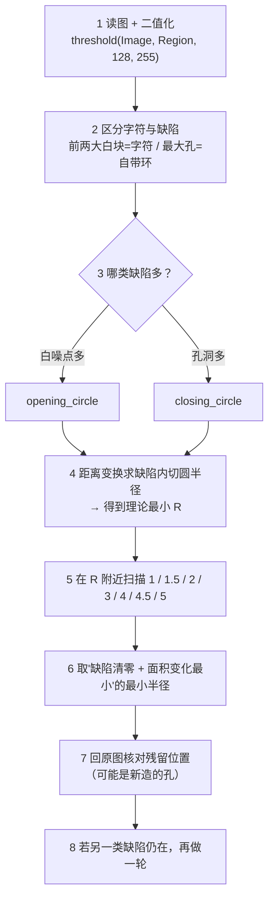

---
tags:
  - Halcon
  - 形态学
  - 参数标定
aliases:
  - 形态学调整
  - 结构元半径
  - Radius 怎么定
  - 开运算 闭运算 半径
created: 2026-09-17
---

# 13 形态学调整 结构元半径标定

> [!abstract] 一句话总结
> 形态学只有一个旋钮 —— 结构元半径 `Radius`。它不是拍脑袋试出来的：**先用距离变换算出缺陷的"内切圆半径"，那就是半径的理论下限；再在它附近从小到大扫一遍，取"缺陷清零、主体面积变化最小"的最小半径。**
> 本篇把 5 张素材的调参过程全部量化，并给出**三个只看原理推不出来的坑**。

> **源素材：** `note/形态学调整/1.bmp` ~ `5.bmp`（与 `note/x1~x5.bmp` 是同一批图，仅编号不同，映射见文末「附录」）
> **理论前置：** [[06 形态学运算]]（四个算子的定义）· [[05 图像预处理与滤波]]（二值化阈值）

## 一、为什么半径可以"算"出来，而不是"试"出来

圆盘结构元有一个极好的性质：**腐蚀和膨胀都等价于"距离阈值"**。

设 $A$ 是白区，$A^c$ 是黑区，$d(p, S)$ 表示点 $p$ 到集合 $S$ 的最近距离，则

$$\text{erode}_R(A) = \{\, p \in A \;\big|\; d(p, A^c) > R \,\} \qquad \text{dilate}_R(A) = \{\, p \;\big|\; d(p, A) \le R \,\}$$

于是开运算、闭运算能干掉多大的缺陷，**完全由"缺陷到边界的距离"决定**：

| 缺陷 | 被清除的条件 | 结论 |
|---|---|---|
| 白斑（噪点） | 斑内每一点到最近**黑点**的距离都 $\le R$ | 用 `opening_circle`，$R \ge$ 白斑的内切圆半径 |
| 孔洞（黑斑） | 孔内每一点到最近**白点**的距离都 $\le R$ | 用 `closing_circle`，$R \ge$ 孔洞的内切圆半径 |


> [!tip] 这个判据的几何说法
> 开运算 = **"能放进区域内部的、所有半径 $R$ 的圆盘"的并集**。
> 所以一句话：**白斑活得下来 ⇔ 斑里塞得下一个半径 $R$ 的圆盘**。半径一旦比缺陷的内切圆大，缺陷必然被抹掉 —— 这就是"理论最小半径"的含义。

> [!note] HDevelop 里怎么算这个距离
> HALCON 原生算子：`distance_transform (Region : DistanceImage : Metric, Foreground, Width, Height)`，
> `Metric` 取 `'euclidean'`、`Foreground` 取 `'true'` 时可得到区域内部各点到边界的距离图。
> 在缺陷区域内取**极大值**，就是它的内切圆半径。
> 注意官方文档写的是 "approximately Euclidean"，`'euclidean'` 是近似欧氏距离；要更精确可改用 `'city-block'` 交叉验证。

## 二、动手之前：先把"字符本身"和"缺陷"分开

这一步做错，后面全错。阈值 128 二值化之后，画面里其实混着**五类东西**（其中只有两类是缺陷）：

| 类别 | 典型例子 | 是缺陷吗 |
|---|---|---|
| 字符主体 | 笔画最大的那块白 | 不是 |
| 字符的**附加白块** | 手写体上方那个分离的点 | 不是 |
| **白噪点** | 散落的孤立小白斑、毛刺 | ✅ 用开运算 |
| 字符自带的**环孔** | "口/日/回"式笔画围出的内部空白 | 不是 |
| **多余孔洞** | 笔画里被噪声啃出的黑点 | ✅ 用闭运算 |

所以统计时我用两条规则把它们分开：

- **白块**：按面积排序，**前两大白块算"字符"**（主体 + 顶部的点），其余白块才是白噪点；
- **孔洞**：只统计**不触边**的内部孔洞，其中**最大的那个孔算"字符自带的环"**，其余才算多余孔洞。

> [!warning] 两种典型翻车
> ① **不分"字符"和"噪声"**：干净图 1.bmp 会被统计出两万多像素的"白噪点"（其实是笔画和点），调参方向直接跑偏。
> ② **把环孔当缺陷**：手写体那个 2231~5432 px 的环孔是**字的一部分**，半径取大就会把"口"磨小（实测见 5.3）。

> [!tip] 判缺陷要看"数量"，不是"有没有"
> 干净图 1.bmp 里其实也有 **1 个 10 px 的小孔**（笔画转折处），但那是正常结构。
> 所以判定门槛设成 **≥ 3 个**才算缺陷 —— 只有 1~2 个小孔时，不值得为它动形态学。

## 三、5 张素材的实测总表（阈值 128）

**原图诊断：**

| 素材 | 尺寸 | 字符面积 | 自带环孔 | 白噪点 | 多余孔洞 | 诊断 |
|---|---|---|---|---|---|---|
| `1.bmp` | 321×443 | 22502 px | 2231 px | 0 个 | 1 个 / 10 px | 干净，不动 |
| `2.bmp` | 321×443 | 22339 px | 2166 px | 5 个 / 16 px | **12 个 / 505 px** | 黑孔洞为主 + 少量白斑 |
| `3.bmp` | 321×443 | 22148 px | 2274 px | **55 个 / 278 px** | 0 个 | 白噪点 |
| `4.bmp` | 445×602 | 42508 px | 3974 px | **359 个 / 5107 px** | 0 个 | 白噪点（密集） |
| `5.bmp` | 498×646 | 49837 px | 5432 px | 0 个 | **74 个 / 1580 px** | 黑孔洞为主 |

**理论最小半径 → 推荐配方：**

| 素材 | 缺陷内切圆半径（白噪点 / 孔洞） | 推荐配方 | 处理后 | 主体面积变化 |
|---|---|---|---|---|
| `1.bmp` | — / 2.00 | **不处理** | —— | +0.00% |
| `2.bmp` | 1.41 / 4.47 | `closing_circle(4.5)` | 白噪点 0、孔洞 0 | **+3.49%** |
| `3.bmp` | 1.00 / — | `opening_circle(1)` | 白噪点 0 | **−0.97%** |
| `4.bmp` | 3.00 / — | `opening_circle(3)` | 白噪点 0 | **−1.52%** |
| `5.bmp` | — / 3.00 ※ | `closing_circle(4.5)` | 孔洞 0 | **+6.25%** |

> [!danger] ※ 唯一一处"理论值和实测对不上"的地方，见第五节 5.1
> `5.bmp` 的孔洞内切圆半径最大只有 **3.00**，按理 `Radius = 3.5` 就该填完；
> 但实测 `3` 和 `3.5` 各残留 1 个孔，要 **4.5** 才干净 —— 因为**闭运算自己会造出新孔**。

## 四、逐张解读

### 4.1 `1.bmp` —— 干净对照，正确做法是"不动它"

![[morph_1.png|240]]

0 个白噪点、1 个 10 px 小孔（不足 3 个 → 不算缺陷）。这张图的价值是**当基准**：后面所有面积变化都以它为参照系，也提醒我们"形态学不是必做步骤"。

### 4.2 `2.bmp` —— 黑孔洞为主，顺带吞掉白斑 → `closing_circle(4.5)`

![[morph_2.png|240]] ![[morph_2_after.png|240]]

12 个孔洞 > 5 个白斑，按"先治数量多的"原则先做闭运算。半径扫描：

| `closing_circle(r)` | 白噪点 | 多余孔洞 | 主体面积变化 | 判定 |
|---|---|---|---|---|
| 1 | 5 / 16 px | 7 / 438 px | +0.38% | 残留 |
| 2 | 3 / 10 px | 6 / 349 px | +0.90% | 残留 |
| 3 | 0 / 0 px | 2 / 148 px | +2.59% | 残留 |
| 4 | 0 / 0 px | 1 / 68 px | +3.42% | 残留 |
| **4.5** | **0** | **0** | **+3.49%** | ★ 清零 |
| 5 | 0 | 0 | +4.00% | ★ 清零（但更伤） |

- 孔洞内切圆半径 **4.47** → 半径必须 **>4.47**，取 **4.5** 最省；
- 注意白噪点从 5 个变 0 个、**白块数从 7 个变 2 个** —— 这不是"去噪"，而是闭运算把贴近笔画的 5 个小斑**粘连并吞进主体**了（见 5.2）；
- 主体面积从 22339 涨到 23119 px，**+3.49%**。

### 4.3 `3.bmp` —— 典型白毛刺/小白点 → `opening_circle(1)`

![[morph_3.png|240]] ![[morph_3_after.png|240]]

55 个白噪点共 278 px，**内切圆半径最大只有 1.00**，所以半径取 **1** 就够了：

| `opening_circle(r)` | 1 | 1.5 | 2 | 3 | 5 |
|---|---|---|---|---|---|
| 白噪点 | 0 | 0 | 0 | 0 | 0 |
| 主体面积变化 | **−0.97%** | −0.95% | −0.99% | −1.36% | −1.63% |

从 `r=1` 起全部清零，**后面每加大一点都只是在多削主体** —— 这正是"取理论下限"的意义。

> [!note] 与 [[06 形态学运算]] 的对照
> 06 篇里对同一张图（那边叫 `x2.bmp`）用的是 `opening_circle(3.5)`，属"宁大勿小"的经验值；
> 实测 `r=1` 就已经清零，`3.5` 的额外代价是主体多掉 0.06%，而且**开运算还会把内部孔洞略微撑大**（环孔：`r=1` 时 +0.04%、`r=6` 时 +0.44%，因为腐蚀先把孔撑开、膨胀并不能完全补回）。
> 结论：**经验值可以作起点，但标定一遍能省下无谓的形变。**

### 4.4 `4.bmp` —— 密集椒盐白噪 → `opening_circle(3)`

![[morph_4.png|240]] ![[morph_4_after.png|240]]

359 个噪点、5107 px，是 5 张里最脏的。半径扫描：

| `opening_circle(r)` | 1 | 1.5 | 2 | 2.5 | **3** | 4 | 5 |
|---|---|---|---|---|---|---|---|
| 白噪点 | 277 个 | 205 个 | 109 个 | 45 个 | **0** | 0 | 0 |
| 主体面积变化 | −0.47% | −0.25% | −1.15% | −0.61% | **−1.52%** | −1.82% | −1.77% |

内切圆半径 **3.00** → 取 **3**，白噪点一次清零，主体只掉 **1.52%**。
（`r=1~2.5` 会残留几十到几百个噪点，是典型的"半径取小了"。）

### 4.5 `5.bmp` —— 大量黑孔洞 → `closing_circle(4.5)`

![[morph_5.png|240]] ![[morph_5_after.png|240]]

74 个孔洞、1580 px，但每个都很小（半径 ≤ 3.00）。扫描结果却有意外：

| `closing_circle(r)` | 1 | 2 | 3 | 3.5 | 4 | **4.5** | 5 |
|---|---|---|---|---|---|---|---|
| 多余孔洞 | 99 个 | 33 个 | 1 个 / 36 px | 1 个 / 37 px | 0 | **0** | 0 |
| 主体面积变化 | +0.84% | +4.20% | +6.05% | +5.87% | +6.94% | **+6.25%** | +6.67% |

`r=3` 和 `r=3.5` 残留的那 1 个孔洞，**在原图里根本不存在** —— 详见 5.1。取 `4.5`（清零且面积变化最小的一档）。

## 五、三个只有实测才能发现的坑

### 5.1 闭运算会"制造"新孔洞

`5.bmp` 的孔洞内切圆半径最大 3.00，理论上 `r=3.5` 应当填满所有孔。实测：

- `r=3` 残留 1 个孔，位置 `行 282–289 / 列 188–194`，36 px；
- `r=3.5` 残留同一个位置的孔，37 px；
- **而原图在 `行 275–300 / 列 180–205` 范围内只有外背景，一个孔都没有。**

也就是说这个孔是**闭运算自己造出来的**：膨胀把笔画之间的窄缝糊住，腐蚀又没能把它掏开，于是在两条笔画之间**围出了一个新的空腔**。

> [!danger] 由此得到两条硬结论
> ① **孔洞数不是半径的单调函数** —— 半径变大时，旧孔被填掉、新孔被造出来，数字可能先降后升；
> ② 扫描表里出现"仍有残留"时，**必须回到原图核对残留位置**，否则会把"新造的孔"误判成"没填干净的旧孔"，从而把半径继续往上加、越加越糟。

### 5.2 闭运算会把贴近笔画的小白斑"咽"进去，而不是去掉

`2.bmp` 原图有 **7 个白块**（主体 + 点 + 5 个白斑），`closing_circle(4.5)` 之后只剩 **2 个白块**、白噪点计数归零。看起来"白噪点被清掉了"，但事实是：膨胀让笔画变胖，把旁边的小白斑**黏了进来**，腐蚀收回去时这些被黏住的斑块已经和主体连成一体、留在了主体里。

所以：**闭运算不是去白噪点的手段**。它的"白噪点归零"是副作用，代价是主体面积 +3.49%。要真去白噪点，用 `opening_circle`；两类缺陷同时存在时，**先闭后开**（或先开后闭，取决于哪一类更多 —— 这里按"多者优先"走的贪心顺序）。

### 5.3 半径取大，会持续蚕食"字本身的环孔"

闭运算在填小孔的同时，也会把字符自带的**大孔"磨圆"**（凹角被填掉），环孔面积因此持续变小：

| `closing_circle(r)` | 4.5 | 6 | 8 | 10 |
|---|---|---|---|---|
| `5.bmp` 主体面积变化 | +6.25% | +7.45% | +8.31% | +9.11% |
| `5.bmp` **环孔**面积变化 | **−5.49%** | −7.44% | −8.76% | −10.44% |

`r=6`（06 篇里对 `x4.bmp` 用的经验值）时，环孔已经掉了 7.4%；取 `4.5` 只掉 5.49%。

> [!warning] 所以"宁大勿小"是错的
> 半径过大有两种代价：**主体被削/增**、**字的内部结构（环孔）被吃掉**。
> 正确策略是**贴着理论下限取值**：`R` 刚过缺陷内切圆半径即可。
> 需要"只填孔、不改变外形"时，改用 `fill_up` 或 `select_shape` 的 `'holes_num'` 直接筛掉带孔的目标，别用闭运算。

## 六、可复用的调参流程



HDevelop 里的落地写法（以 `2.bmp` 为例）：

```c
* 1 读图 + 二值化
read_image (Image, '2.bmp')
threshold (Image, Region, 128, 255)

* 2 打散，方便区分"字符"与"缺陷"
connection (Region, ConnectedRegions)

* 3 取黑区（候选孔洞），并排除触边的外背景
complement (Region, RegionComplement)
connection (RegionComplement, Holes)
*    外背景一定从图像边缘开始 → 要求 row1 ≥ 1 且 column1 ≥ 1 即可把它踢掉
select_shape (Holes, InnerHoles, ['row1','column1'], 'and', [1,1], [99999,99999])

* 4 距离变换 → 在孔洞区域内取极大值 = 内切圆半径（半径下限）
get_image_size (Image, Width, Height)
distance_transform (Region, DistanceImage, 'euclidean', 'true', Width, Height)

* 5~6 按标定结果落地：4.5 是"刚好填满全部孔洞"的最小半径
closing_circle (Region, RegionClosing, 4.5)
```

> [!warning] HDevelop 的注释必须独占一行
> 官方原文：*a comment is marked by entering an asterisk (`*`) as first non-whitespace character*。
> 所以 **`xxx (…)  * 说明` 这种行尾注释是不合法的**，`*` 只能出现在行首。

> [!tip] 半径不必是整数
> HALCON 的 `Radius` 是**实数**。`4.47` 的内切圆半径取 `4.5` 就够，没必要跳到 `5`——
> 每多 0.5 都在多削一点主体。上面的表里 `4.5 → +3.49%`、`5 → +4.00%`，差别是实打实的。

## 七、自检

> [!question]
> 1. 一个白噪点是半径 2.5 的圆斑，开运算半径至少取多少？——**2.5 以上**（严格大于）。取 2 会残留、取 3 稳妥；理论值就是"圆斑内切圆半径"。
> 2. 为什么孔洞数会随半径"先降后升"？——见 5.1：闭运算糊住窄缝会**新围出**空腔，旧孔没了新孔来了。
> 3. `1.bmp` 明明有 1 个孔洞，为什么推荐"不处理"？——因为 1 个 10 px 的孔在阈值下属正常结构，**判缺陷看数量（≥3）**，只有 1~2 个时动形态学是得不偿失。
> 4. 想保留零件的真实尺寸，同时又想弄干净噪点，怎么办？——不要把形态学放进测量链路：改用 `select_shape` 按 `'area'` / `'holes_num'` 直接筛掉噪点与带孔目标；或只在"修形区域"上取形状、在原区域上取尺寸。
> 5. `closing_circle(4.5)` 之后白噪点计数变成 0，说明闭运算能去白噪点吗？——**不能**。计数归零是小白斑被"黏并"进主体（见 5.2），不是被消除。

---

## 附录：编号映射与素材说明

`note/形态学调整/` 这 5 张图与库里原有的 `note/x1~x5.bmp` **逐字节相同**（已用 MD5 校验），只是编号顺序不同：

| 本篇用 | 等价于 | 内容 | 备注 |
|---|---|---|---|
| `形态学调整/1.bmp` | `x5.bmp` | 干净对照 | [[06 形态学运算]] 里的 `x5` |
| `形态学调整/2.bmp` | `x1.bmp` | 少量白斑 + 12 个黑孔洞 | —— |
| `形态学调整/3.bmp` | `x2.bmp` | 白毛刺 / 孤立小白点 | 06 篇里的 `x2` |
| `形态学调整/4.bmp` | `x3.bmp` | 密集白噪点（359 个） | —— |
| `形态学调整/5.bmp` | `x4.bmp` | 大量黑孔洞（74 个） | 06 篇里的 `x4` |

> [!info] 这批素材没有配套的 `.hdev`
> 文件夹名 `形态学调整` 本身就点明了用途 —— **它是用来调参数的**。
> 因此本篇的定位不是"解读某个练习工程"，而是补上 [[06 形态学运算]] 缺的那一环：
> **把"半径该取多大"从经验值升级成可标定的流程**。

---
上一步：[[06 形态学运算]] · 返回：[[00 Halcon学习地图]] · 相关：[[05 图像预处理与滤波]] · [[10 算子速查表]]
