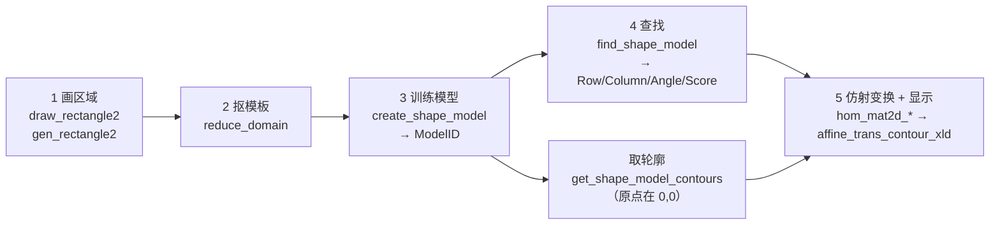

---
tags:
  - Halcon
  - 模板匹配
  - 形状匹配
  - 实战
aliases:
  - 形状匹配
  - Shape-Based Matching
  - create_shape_model
  - find_shape_model
created: 2026-09-16
---

# 14 模板匹配 形状匹配 Shape-Based Matching

> [!abstract] 一句话总结
> 形状匹配 = 拿一块 ROI 当"模板"，让 HALCON 在整幅图里按**轮廓形状**（不是灰度块）去找它，一次返回每个实例的 $(Row,\ Column,\ Angle,\ Score)$。
> 标准五步：**画区域 → `reduce_domain` 抠模板 → `create_shape_model` 训练 → `find_shape_model` 查找 → 用仿射变换把模型轮廓搬到结果位置显示**。

> **源文件（本轮新增）：**
> - `note/模板匹配/01曲别针模版匹配.hdev`
> - `note/模板匹配/02套环检测.hdev`
> - `note/模板匹配/03带缩放的模版匹配.hdev`
>
> **素材：**
> - `clip`（HALCON 自带示例图，同 [[09 实战 曲别针计数与角度]]）
> - `note/模板匹配/模版匹配/smd_capacitors_01~04.png`（PCB 上的贴片电容，本轮新增）
>
> ![[smd_capacitors_03.png|240]]
> 该图为 `smd_capacitors_03.png`：灰色 PCB 底板上分布着若干**亮白矩形贴片电容**，大小、朝向不一致 —— 这正是"必须带缩放匹配"的典型场景。

## 一、形状匹配在解决什么问题

| 对比项 | Blob 分析（03/04/09） | 形状匹配（本篇） |
|---|---|---|
| 判据 | 灰度阈值 / 面积 / 圆度等**特征** | 模板的**轮廓梯度形状** |
| 前提 | 目标与背景灰度可分 | 事先要有一张模板（ROI） |
| 能拿到什么 | 每个连通域的位置、面积、角度 | 每个实例的 **位置 + 旋转角 + 得分**，亚像素级 |
| 抗干扰 | 背景一变就崩 | 允许遮挡、允许杂乱背景（靠 `MinScore` 兜底） |
| 尺度变化 | 天然支持（面积特征随之变） | **默认不支持**，要换 `*_scaled_*` / `*_aniso_*` 系列 |
| 代价 | 便宜 | 训练要建金字塔、要选参数，调不好会漏检或乱报 |

> [!note] 一句话定位
> Blob 是"**按长相筛**"，形状匹配是"**照着照片找人**"。
> 当你知道目标长什么样、但没法用一两个阈值把它抠出来时，就用形状匹配。

## 二、五步流程



## 三、第 1~2 步：画区域与抠模板

```c
dev_set_draw ('margin')
dev_set_line_width (3)
* 画一块区域 , 扣下来当模版
draw_rectangle2 (WindowHandle, Row, Column, Phi, Length1, Length2)
gen_rectangle2 (Rectangle, Row, Column, Phi, Length1, Length2)
* 把画下来的区域扣下来当模版
reduce_domain (Image, Rectangle, ImageReduced)
```

| 行 | 说明 |
|---|---|
| `dev_set_draw ('margin')` | 只画**外框**不填充，方便看清 ROI 盖住了什么 |
| `draw_rectangle2` | **交互式**算子：鼠标在窗口上拖一个**带角度**的矩形，松手后返回中心 $(Row,\ Column)$、角度 $Phi$、半长 $Length1$、半宽 $Length2$ |
| `gen_rectangle2` | 把上面那组数字**还原成一个 Region 对象**（`draw_*` 只出数字，不出 Region） |
| `reduce_domain` | 把图像的**有效范围（domain）**限制到这个 Region。此后 `ImageReduced` "看起来"还是整幅尺寸，但只有 ROI 内有效 |

> [!warning] `reduce_domain` 不是抠图，但它**正好**是模板匹配要的
> [[12 仿射变换实战 区域轮廓与抠图]] 里强调过：`reduce_domain` **不改矩阵尺寸**，只改 domain；`crop_domain` 才把矩阵裁小。
> 而 `create_shape_model` 用的正是 **"图像 domain（ROI）"** 来定义模板范围，并取其**重心**作为模型原点 ——
> 所以这里**必须**用 `reduce_domain`，用 `crop_domain` 反而会把模板原点挪到裁剪后小图的重心（通常不是你想要的）。
>
> 另外 `draw_rectangle2` 是交互算子，**批量/离线跑会卡住**。工程化时把 `Row/Column/Phi/Length1/Length2` 写成常量，只保留 `gen_rectangle2`。

## 四、第 3 步：`create_shape_model` 参数全解

```c
create_shape_model (Template, NumLevels, AngleStart, AngleExtent, AngleStep, \
                    Optimization, Metric, Contrast, MinContrast, ModelID)
```

| 参数 | 01 里取值 | 含义 | 怎么选 |
|---|---|---|---|
| `Template` | `ImageReduced` | 模板图，**ROI 由它的 domain 给出** | 先用 `reduce_domain` 限定 |
| `NumLevels` | `'auto'` | 金字塔层数 | **尽量大**（查找快），但最高层必须还剩 **≥4 个模型点**，否则内部会自动降层；降到底仍不足就报错。用 `inspect_shape_model` 看 |
| `AngleStart` | `-rad(180)` | 可能出现的最小旋转角 | **弧度**，不是度 |
| `AngleExtent` | `rad(180)` | 旋转范围（这里 = 整圈） | 范围越大，模型越大、越慢 |
| `AngleStep` | `'auto'` | 角度步长 | 不开亚像素时它就决定了**角度分辨率**；小模型要取**大**一些 |
| `Optimization` | `'auto'` | 是否抽稀模型点 | 只对象征性**大模型**有意义；抽稀后查找时要把 `Greediness` 调小（0.7~0.8） |
| `Metric` | `'use_polarity'` | 对比度匹配规则 | 见下表 |
| `Contrast` | `'auto'` | 模型点所需对比度 | 可给 2 个值做**滞后阈值** $[下,上]$，也可给 3 个值 $[下,上,最小尺寸]$ |
| `MinContrast` | `'auto'`（03 里写死 `5`） | 把**模型与噪声**分开 | 噪声大就调大；`'auto'` 兜底不行时再手调 |
| `ModelID` | 输出 | 模型句柄 | 后面 `find_shape_model` / `get_shape_model_contours` 都靠它 |

### `Metric` 四档（最容易踩的一档）

| 取值 | 含义 | 代价 |
|---|---|---|
| `'use_polarity'` | 目标与模型**对比度必须一致**（亮目标只能匹配亮目标） | 最快 |
| `'ignore_global_polarity'` | 允许**全局反色**（亮↔暗整体翻转） | 略慢 |
| `'ignore_local_polarity'` | 允许**局部**对比度变化（目标内部有更亮/更暗的子块） | **明显变慢** |
| `'ignore_color_polarity'` | 允许**颜色**对比度变化，且**支持多通道** | 明显变慢 |

> [!danger] 前三种度量**只支持单通道**
> 官方文档原文：多通道图像做模板或搜索图时，**只使用第一个通道，而且不会返回错误消息**。
> 也就是说你喂一张 RGB 图进去，它静默地只用 R 通道 —— 结果不对也不会报警。要么先 `rgb1_to_gray`，要么改用 `'ignore_color_polarity'`。

> [!tip] 对比度变化很大时，别硬扛
> 与其用 `'ignore_local_polarity'` 拖慢速度，不如**建多个模型**覆盖可能的对比度形态，再用 `find_shape_models`（复数）一次性同时匹配。

## 五、第 4 步：`find_shape_model` 参数全解

```c
find_shape_model (Image, ModelID, AngleStart, AngleExtent, MinScore, NumMatches, \
                  MaxOverlap, SubPixel, NumLevels, Greediness, \
                  Row, Column, Angle, Score)
```

| 参数 | 01 里取值 | 含义 | 怎么选 |
|---|---|---|---|
| `AngleStart` / `AngleExtent` | `-rad(180)` / `rad(180)` | 搜索的旋转范围 | 会被**裁剪到创建时给的范围**；两者的角度范围**必须有重叠**，否则一个都找不到 |
| `MinScore` | `0.5` | 得分下限 | 越大越快；目标**永不遮挡**时可取 `0.8`~`0.9` |
| `NumMatches` | `15` | 最多返回几个 | **`0` = 全部返回**。`MinScore` 优先于 `NumMatches`（不够就少返回） |
| `MaxOverlap` | `0` | 两个实例最多能重叠多少（0~1） | `0` = 找到的实例**互不重叠**；模型有对称性时要调大 |
| `SubPixel` | `'least_squares_very_high'` | 是否亚像素 | 见下表 |
| `NumLevels` | `0` | 用几层金字塔 | `0` = 用模型的全部层 |
| `Greediness` | `0` | 贪心程度 | `0` = 安全但**慢**；`1` = 快但**可能漏检**。抽稀过模型点时必须降到 0.7~0.8 |

### `SubPixel` 档位

| 取值 | 行为 | 速度 |
|---|---|---|
| `'none'`（`'false'`） | 只到**像素级**位置 + 创建时 `AngleStep` 的角度分辨率 | 最快 |
| `'interpolation'`（`'true'`） | 对得分函数做插值 → 亚像素 | **几乎不花时间**，官方默认推荐 |
| `'least_squares'` | 最小二乘平差（最小化模型点到图像点距离） | 慢一些，**精度/耗时折中最佳** |
| `'least_squares_high'` / `'least_squares_very_high'` | 更高精度的搜索 | 越往后越慢 |
| `['least_squares', 'max_deformation 2']` | 额外允许**最多 2 像素形变**（取值 0~32） | 形变大则更慢 |

> [!warning] `NumMatches=1` 拿到的**不一定**是全场最高分
> 金字塔逐层剪枝时，每一层都会按 `NumMatches` 淘汰较差的候选，所以"最低层本可以得分更高"的候选可能在中途就被砍了。
> 官方明确说：`NumMatches=1` 的结果可能和 `NumMatches=0`（或 >1）里挑出的最高分**不是同一个**。
> 要"多个相近目标里只取最好的那个"，正解是 **把 `NumMatches` 调大再自己在 `Score` 里挑最大**。

## 六、模型原点与 `get_shape_model_contours`

```c
get_shape_model_contours (ModelContours, ModelID, 1)
```

两个必须记住的事实：

1. **模型原点默认 = 模板图 domain（ROI）的重心**；可用 `set_shape_model_origin` 另设。
2. `get_shape_model_contours` 输出的轮廓被**归一化**过 —— 参考点被挪到了像素位置 $(0,0)$。
   所以它的默认显示位置是**图像左上角**，01 的注释"看一下 模版特征 ,(默认显示到左上角)"说的就是这件事。

显示时因此要"**先在原点旋转/缩放，最后再平移到结果位置**"：

```c
hom_mat2d_identity (A)
hom_mat2d_rotate (A, Angle[Index], 0, 0, B)          * 绕 (0,0) 转
hom_mat2d_translate (B, Row1[Index], Column1[Index], C) * 再搬到找到的位置
affine_trans_contour_xld (ModelContours, ContoursAffineTrans, C)
```

`Level` 参数取 `1` = 最细（原分辨率）那层；想看抽稀后的骨架就取更大的层号。

> [!danger] `find_shape_model` **不认** `set_shape_model_origin`
> 官方原文：搜索空间用的是"**创建模型时那个图像 domain 的重心**"，"通过 `set_shape_model_origin` 设置的其他原点**不予考虑**"。
> 换句话说，改原点只会影响**轮廓显示 / 结果坐标的基准**，不会帮你挪动搜索范围。想限制搜索范围，正确做法是直接缩小 `Image` 的 domain。

## 七、01 完整源码逐段解读

```c
* 模版匹配
read_image (Image, 'clip')
get_image_size (Image, Width, Height)
dev_close_window ()
dev_open_window (0, 0, Width/2, Height/2, 'black', WindowHandle)
dev_display (Image)

* 设置显示模式
dev_set_draw ('margin')
dev_set_line_width (3)

* 画一块区域 , 扣下来当模版
draw_rectangle2 (WindowHandle, Row, Column, Phi, Length1, Length2)
gen_rectangle2 (Rectangle, Row, Column, Phi, Length1, Length2)
dev_clear_window ()
dev_display (Image)
dev_display (Rectangle)

* 把画下来的区域扣下来当模版
reduce_domain (Image, Rectangle, ImageReduced)
dev_clear_window ()
dev_display (ImageReduced)

* 训练模版
* 创建一个模版匹配的句柄
create_shape_model (ImageReduced, 'auto', -rad(180), rad(180), \
                    'auto', 'auto', \
                    'use_polarity', 'auto', 'auto', ModelID)

* 看一下 模版特征 ,(默认显示到左上角)
get_shape_model_contours (ModelContours, ModelID, 1)

* 利用模版 来进行匹配
find_shape_model (Image, ModelID, -rad(180), rad(180), 0.5, 15, 0, \
                  'least_squares_very_high', 0, 0, Row1, Column1, Angle, Score)

* 显示找到的
dev_clear_window ()
dev_display (Image)

* 循环进行仿射变换
for Index := 0 to |Score|-1 by 1
    * 生成矩阵
    hom_mat2d_identity (A)
    * 旋转
    hom_mat2d_rotate (A, Angle[Index], 0, 0, B)
    * 平移
    hom_mat2d_translate (B, Row1[Index], Column1[Index], C)
    * 仿射变换
    affine_trans_contour_xld (ModelContours, ContoursAffineTrans, C)
    * 显示
    dev_display (ContoursAffineTrans)
    stop ()
endfor
```

| 段 | 关键点 |
|---|---|
| `dev_open_window (0, 0, Width/2, Height/2, ...)` | 窗口**缩到一半**显示（原图 640×480 之类，全开太大） |
| `for Index := 0 to \|Score\|-1 by 1` | `\|Score\|` 是**元组长度**；因为下标从 0 起，所以上界要 `-1` |
| `hom_mat2d_rotate (A, Angle[Index], 0, 0, B)` | 固定点写 `(0,0)` —— 因为轮廓此刻就在原点（呼应 [[11 仿射变换矩阵与图像变换]] 的"固定点是**当前坐标系**下的点"） |
| `affine_trans_contour_xld` | 只搬**点坐标**，不重采样灰度，最快且不丢亚像素精度 |
| `stop ()` | 每个实例停一次，按 F5 继续 —— 调试用，工程里删掉 |

## 八、带缩放的匹配：`*_aniso_shape_model`（03）

`create_shape_model` **不带缩放**。目标大小会变时有两个选择：

| 系列 | 缩放自由度 | 算子 |
|---|---|---|
| `create_scaled_shape_model` | **各向同性**（行、列同倍率） | `find_scaled_shape_model` |
| `create_aniso_shape_model` | **各向异性**（行、列**独立**倍率） | `find_aniso_shape_model` |

```c
create_aniso_shape_model (Template, NumLevels, AngleStart, AngleExtent, AngleStep, \
                          ScaleRMin, ScaleRMax, ScaleRStep, \
                          ScaleCMin, ScaleCMax, ScaleCStep, \
                          Optimization, Metric, Contrast, MinContrast, ModelID)
```

```c
find_aniso_shape_model (Image, ModelID, AngleStart, AngleExtent, \
                        ScaleRMin, ScaleRMax, ScaleCMin, ScaleCMax, \
                        MinScore, NumMatches, MaxOverlap, SubPixel, NumLevels, Greediness, \
                        Row, Column, Angle, ScaleR, ScaleC, Score)
```

03 的实参对应关系（**注意输入顺序和 `create_*` 不一样**）：

| `create_aniso_shape_model` | 值 | `find_aniso_shape_model` | 值 |
|---|---|---|---|
| `NumLevels` | `'auto'` | `AngleStart` | `-rad(180)` |
| `AngleStart` | `-rad(180)` | `AngleExtent` | `rad(180)` |
| `AngleExtent` | `rad(180)` | `ScaleRMin` | `0.5` |
| `AngleStep` | `'auto'` | `ScaleRMax` | `2.5` |
| `ScaleRMin` / `ScaleRMax` / `ScaleRStep` | `0.5` / `2.5` / `'auto'` | `ScaleCMin` | `0.5` |
| `ScaleCMin` / `ScaleCMax` / `ScaleCStep` | `0.5` / `2.5` / `'auto'` | `ScaleCMax` | `2.5` |
| `Optimization` | `'auto'` | `MinScore` | `0.5` |
| `Metric` | `'use_polarity'` | `NumMatches` | `0`（全部） |
| `Contrast` | `'auto'` | `MaxOverlap` | `0.5` |
| `MinContrast` | `5` | `SubPixel` | `'least_squares'` |
| | | `NumLevels` | `0` |
| | | `Greediness` | `0` |

> [!note] `ScaleR` vs `ScaleC`
> `ScaleR` = **行方向**（竖直）缩放倍率，`ScaleC` = **列方向**（水平）缩放倍率。
> 各向异性的价值就在这：目标被"拉扁/拉长"（比如贴片电容的封装方向不同）时也能匹配上。

### 显示时多了一步：先缩放

```c
hom_mat2d_identity (A)
* 缩放 , 旋转 , 平移
hom_mat2d_scale (A, ScaleR[Index], ScaleC[Index], 0, 0, B)
hom_mat2d_rotate (B, Angle[Index], 0, 0, C)
hom_mat2d_translate (C, Row1[Index], Column1[Index], D)
affine_trans_contour_xld (ModelContours, ContoursAffineTrans, D)
```

> [!warning] 顺序是 **缩放 → 旋转 → 平移**，不能乱
> 三步的固定点都写 `(0,0)`，因为轮廓一开始就在原点。
> 一旦把 `hom_mat2d_translate` 提到前面，后面两步的固定点就不再是 `(0,0)` 了（[[12 仿射变换实战 区域轮廓与抠图]] 坑位第 4 条：固定点是"当前坐标系"下的点，05 就踩过）。

## 九、02 套环检测：批处理骨架

```c
* 练习套环
list_files ('套环检测', 'files', Files)
* 在外面扣模版, 训练模型
for Index := 0 to |Files|-1 by 1
    read_image (Image, Files[Index])
    stop ()
endfor
```

这只是个**读图循环**骨架：作者的意图写在注释里（"在外面扣模版, 训练模型"），真正的训练/匹配还没写。
用到的素材 `图像00228.BMP` / `图像00235.BMP` 已经在本库里（MD5 与 `note/套环检测/` 下同名文件**逐字节相同**，本轮未重复入库），完整做法见 [[08 实战 套环检测]]。

`list_files ('套环检测', 'files', Files)` 的目录是**相对于 HDevelop 当前工作目录**的，换机器跑之前先确认当前目录，否则 `Files` 会是空元组、循环一次都不进。

## 十、调参硬数字（全部来自官方文档，不是经验拍脑袋）

| 场景 | 官方给的数 |
|---|---|
| `NumLevels` 上限判据 | 最高金字塔层必须还剩 **≥4 个模型点**；不够内部会自动降层 |
| `MinScore` 上限 | 目标永不遮挡时可取 **0.8 ~ 0.9** |
| `Optimization` 抽稀后 | `Greediness` 建议降到 **0.7 ~ 0.8** |
| `SubPixel` 默认推荐 | **`'interpolation'`**；要最小二乘优先 `'least_squares'` |
| `max_deformation` 取值范围 | **0 ~ 32**（整数，像素） |
| 模型贴边 | 模型必须**完全落在图像内**才可能被找到；想允许出界要 `set_system ('border_shape_models', 'true')`（会变慢） |

## 十一、坑位清单

> [!warning] 形状匹配十一坑
> 1. **角度单位是弧度**：`-rad(180)` / `rad(180)`，写 `180` 就是 180 弧度（约 10313°），完全不对。
> 2. **创建与查找的角度范围必须有重叠**，否则一个都找不到（查找范围会被裁剪到创建范围）。
> 3. **抠模板用 `reduce_domain`，不是 `crop_domain`** —— 模型原点取的是 domain 的重心。
> 4. **模板/模型必须完全在图像内**才可能被找到；贴着边界也可能漏，必要时开 `border_shape_models`（会变慢）。
> 5. **`'use_polarity'` 要求对比度一致**：背景反了就换 `'ignore_global_polarity'`。
> 6. **多通道图只取第一通道且不报错**（`Metric` 前三种）—— 静默出错，最难查。
> 7. **`NumMatches=1` ≠ 全场最高分**：金字塔逐层剪枝会提前淘汰候选。
> 8. **`NumMatches=0` 才是"找全部"**，写 15 就最多只回 15 个。
> 9. **循环上界是 `\|Score\|-1`**：元组下标从 0 起；`select_obj` 却是**从 1 起**，两套编号别混。
> 10. **`draw_rectangle2` 是交互算子**，离线跑会卡住，工程化要写死坐标。
> 11. **`get_shape_model_contours` 的轮廓在 $(0,0)$**：必须先旋转/缩放、最后平移；顺序写反会飞出画面。
> 12. **`set_shape_model_origin` 改的原点，`find_shape_model` 不认**（搜索空间仍用创建时 ROI 的重心）。

## 十二、自检

> [!question]
> 1. `create_shape_model` 的 9 个输入参数分别是什么？01 里全写 `'auto'` 的有哪几个？
> 2. 为什么抠模板要用 `reduce_domain` 而不是 `crop_domain`？两者对"模型原点"的影响分别是什么？
> 3. `Metric` 四档的区别？喂一张 RGB 图进去会发生什么？会不会报错？
> 4. 为什么 `NumMatches=1` 拿到的不一定是全场最高分？正确的"只取最好的那个"该怎么写？
> 5. `get_shape_model_contours` 取出来的轮廓为什么显示在左上角？要画到找到的位置上，三步矩阵怎么写、顺序能不能换？
> 6. aniso 系列比普通 `create_shape_model` 多出来的 6 个参数是什么？`ScaleR` 和 `ScaleC` 分别管哪个方向？
> 7. 什么情况下该开 `border_shape_models`？代价是什么？
> 8. 02 的 `list_files ('套环检测', 'files', Files)` 在什么情况下会返回空元组？

---

上一步：[[12 仿射变换实战 区域轮廓与抠图]] · 下一步：[[15 测量模型 2D Metrology]] · 相关：[[09 实战 曲别针计数与角度]]、[[08 实战 套环检测]] · 回到：[[00 Halcon学习地图]]
