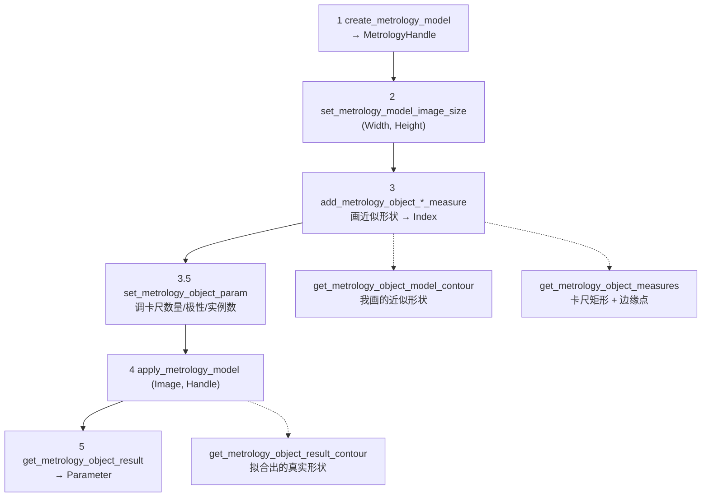

---
tags:
  - Halcon
  - 测量
  - 2D计量
  - Metrology
aliases:
  - 2D Metrology
  - 卡尺测量
  - create_metrology_model
  - 找圆找线找矩形
created: 2026-09-16
---

# 15 测量模型 2D Metrology

> [!abstract] 一句话总结
> 2D 计量的套路是：**先在图上画一个"差不多"的圆 / 线 / 矩形**，HALCON 沿它的边界自动摆一排**卡尺（measure region）**，在每个卡尺里做一维边缘提取，再用 **RANSAC** 把所有边缘点**拟合**成真实几何形状，最后返回亚像素级的参数。
> 五步：`create_metrology_model` → `set_metrology_model_image_size` → `add_metrology_object_*_measure` → `apply_metrology_model` → `get_metrology_object_result`。
> 跟 [[14 模板匹配 形状匹配]] 搭档就是工业现场最常见的"**先定位、后测量**"：模板匹配给 $(Row, Column, Angle)$ → `set_metrology_model_param('reference_system')` 定基准 → 每张新图 `align_metrology_model` 对齐 → `apply_metrology_model`。

> **源文件（本轮新增）：**
> - `note/测量/01找线.hdev`、`02找圆.hdev`、`03找矩形.hdev`、`04点到线点到点.hdev`、`05定位测量.hdev`
> - `note/测量/my/找圆.hdev`、`my/找矩形.hdev`、`my/测量距离.hdev`、`my/定位测量.hdev`、`my/定位测量2.hdev`
>
> **素材：** `note/测量/测量/0.bmp`、`2.bmp`、`3.bmp`（同一零件不同姿态），`note/测量/test.bmp`、`test2.bmp`
>
> ![[测量_2.png|260]]
> 该图为 `测量_2.png`（640×480）：暗背景上一个**亮的零件**，内部有孔、边缘有台阶 —— 典型的"用卡尺找边界再算尺寸"的场景。

## 一、2D 计量在做什么

| 方式 | 做法 | 精度 | 适合 |
|---|---|---|---|
| Blob（03/04/07） | 二值化 → 连通域 → `area_center` | 像素级 | 数个数、粗定位 |
| `measure_pos` / `measure_pairs` | **手工**摆 1 个（或 1 对）矩形卡尺，在卡尺内找边缘点 | 亚像素 | 已知确切位置、只量一个点/一段距离 |
| **2D Metrology（本篇）** | 给一个**近似几何形状**，自动生成 N 个卡尺 + RANSAC 拟合 | 亚像素 | 找**整条线 / 整个圆 / 整个矩形**，且位置可能漂 |

一句话：**`measure_pos` 是"一把卡尺"，2D Metrology 是"沿着你画的形状自动摆一圈卡尺，再拟合成形"。**

## 二、五步流程与三个 `get`



## 三、第 3 步：`add_metrology_object_*_measure` 参数全解

HALCON 提供 4 个便捷算子 + 1 个通用算子，参数完全一致，只是"形状参数"不同：

```c
add_metrology_object_line_measure (MetrologyHandle, RowBegin, ColumnBegin, RowEnd, ColumnEnd, \
                                   MeasureLength1, MeasureLength2, MeasureSigma, MeasureThreshold, \
                                   GenParamName, GenParamValue, Index)
add_metrology_object_circle_measure (MetrologyHandle, Row, Column, Radius, \
                                     MeasureLength1, MeasureLength2, MeasureSigma, MeasureThreshold, \
                                     GenParamName, GenParamValue, Index)
add_metrology_object_rectangle2_measure (MetrologyHandle, Row, Column, Phi, Length1, Length2, \
                                         MeasureLength1, MeasureLength2, MeasureSigma, MeasureThreshold, \
                                         GenParamName, GenParamValue, Index)
add_metrology_object_ellipse_measure (MetrologyHandle, Row, Column, Phi, Radius1, Radius2, \
                                      MeasureLength1, MeasureLength2, MeasureSigma, MeasureThreshold, \
                                      GenParamName, GenParamValue, Index)

* 通用版：用 Shape + ShapeParam 一次覆盖上面四种
add_metrology_object_generic (MetrologyHandle, Shape, ShapeParam, \
                              MeasureLength1, MeasureLength2, MeasureSigma, MeasureThreshold, \
                              GenParamName, GenParamValue, Index)
```

### `Shape` 与 `ShapeParam` 的对应关系

| `Shape` | `ShapeParam` 内容 | 顺序 |
|---|---|---|
| `'circle'` | 圆心 + 半径 | `[Row, Column, Radius]` |
| `'ellipse'` | 中心 + 主轴角 + 长半轴 + 短半轴 | `[Row, Column, Phi, Radius1, Radius2]` |
| `'rectangle2'` | 中心 + 主轴角 + 长半边 + 短半边 | `[Row, Column, Phi, Length1, Length2]` |
| `'line'` | 起点 + 终点 | `[RowBegin, ColumnBegin, RowEnd, ColumnEnd]` |

### 四个 `Measure*` 参数（卡尺的几何）

| 参数 | 默认值 | 含义 |
|---|---|---|
| `MeasureLength1` | **20.0** | 卡尺**垂直于**对象边界方向的半长 —— **这就是"测量容差"**：真实边缘离你画的形状多远之内还能被找到 |
| `MeasureLength2` | **5.0** | 卡尺**沿（切向）**对象边界方向的半长 —— 卡尺有多"宽" |
| `MeasureSigma` | —— | 高斯平滑的 $\sigma$，同 `measure_pos` 的 `Sigma` |
| `MeasureThreshold` | —— | 最小**边缘幅度**（一阶导绝对值阈值），同 `measure_pos` 的 `Threshold` |

本轮源码里的实际取值：

| 文件 | 形状 | `MeasureLength1` | `MeasureLength2` | `Sigma` | `Threshold` |
|---|---|---|---|---|---|
| `01找线.hdev` | line（用 generic） | 20 | 0.5 | 1 | 30 |
| `02找圆.hdev` | circle | 10 | 2 | 1 | 30 |
| `03找矩形.hdev` | rectangle2 | 10 | 2 | 1 | 30 |
| `04点到线点到点.hdev` | circle + line | 15 / 20 | 5 / 5 | 1 / 1 | 30 / 30 |
| `my/测量距离.hdev` | 6 个对象 | 15~20 | 2~5 | 1 | 30 |

> [!tip] `MeasureLength1` 是第一优先要调的数
> 它决定"容差"。零件放歪了一点、或者你手画的圆跟真实轮廓差几个像素，全靠它兜住；
> 但调太大会把**旁边的干扰边缘**一起吞进卡尺，拟合结果就飘了。

## 四、第 3.5 步：`set_metrology_object_param` 调卡尺

```c
set_metrology_object_param (MetrologyHandle, Index, GenParamName, GenParamValue)
```
`Index` 可以写 `'all'`（本轮源码全用的 `'all'`），也可以写 `add_*` 返回的那个索引。

| 参数 | 默认值 | 含义 |
|---|---|---|
| `num_measures` | **10** | 卡尺**个数**；不够会被强制抬到下限（圆 3 / 椭圆 5 / 直线 2 / 矩形每边 2 共 8） |
| `measure_distance` | 10.0 | 相邻卡尺中心的**间距**；与 `num_measures` **互斥** |
| `measure_transition` | —— | 边缘极性：`'positive'`（暗→亮）/ `'negative'`（亮→暗）/ `'all'` / `'uniform'` |
| `measure_sigma` / `measure_threshold` / `measure_select` | —— | 同 `measure_pos` 的 `Sigma` / `Threshold` / `Select` |
| `num_instances` | **1** | 每个对象最多拟合出几个实例 |
| `min_score` | **0.7** | 实例有效的最低得分 = **检测到的边缘数 ÷ 最大测量区域数** |
| `distance_threshold` | **3.5** | RANSAC 判定"边缘点属于该形状"的距离阈值 |
| `max_num_iterations` | —— | RANSAC 迭代次数上限 |

> [!danger] `num_measures` 和 `measure_distance` 只能二选一
> 官方文档原文：设置了 `measure_distance` 时，`num_measures` **不起作用**；反之亦然。
> 两个都写会出现"改了没反应"的假象 —— 本轮源码只用了 `num_measures`（01 设为 20）。

> [!note] `min_score` 的物理意义
> 它是**"卡尺里成功找到边缘的比例"**。
> 官方说：如果确信目标所有边缘都在，可以设到 `0.8`~`0.9`；
> 反过来，**背景杂波强时不要低于 0.7**，否则会拟合出错误的实例。

## 五、第 4~5 步：执行与取结果

```c
apply_metrology_model (Image, MetrologyHandle)
get_metrology_object_result (MetrologyHandle, Index, Instance, GenParamName, GenParamValue, Parameter)
```

`Index` / `Instance` 都可以写 `'all'`。`GenParamName` 用 `'result_type'`，`GenParamValue` 写 `'all_param'` 就能一次拿到全部参数。

**`all_param` 的输出顺序（官方定义，务必背下来）：**

| 形状 | `Parameter` 顺序 | 个数 |
|---|---|---|
| circle | `[row, column, radius]` | 3 |
| ellipse | `[row, column, phi, radius1, radius2]` | 5 |
| line | `[row_begin, column_begin, row_end, column_end]` | 4 |
| rectangle2 | `[row, column, phi, length1, length2]` | 5 |

> 未设置相机参数与位姿时返回**像素单位**；设了 `camera_param` + `pose` 则返回**公制坐标**。

### 三个 `get` 别混（最常搞错的地方）

| 算子 | 拿到的是什么 | 什么时候用 |
|---|---|---|
| `get_metrology_object_model_contour (Contour, Handle, Index, Resolution)` | **你画的那个近似形状**（测之前的名义位置） | 检查"我摆的位置对不对" |
| `get_metrology_object_measures (Contours, Handle, Index, Transition, Row, Column)` | **卡尺矩形**，同时把实测边缘点输出到 `Row / Column` | 调参时看卡尺有没有盖住真实边缘 |
| `get_metrology_object_result_contour (Contour, Handle, Index, Instance, Resolution)` | **拟合出来的真实形状**（测量结果） | 显示最终测量结果 |

`Resolution` 通常写 `1.5`，表示轮廓相邻点的近似间距（像素）。

> [!danger] `all_param` 是**按"添加顺序 × 实例"拼成的一维元组**，下标要自己算
> `my/测量距离.hdev` 一口气加了 6 个对象，它的下标映射是：
>
> | 对象（按 `add_*` 顺序） | 形状 | `Parameter` 下标 |
> |---|---|---|
> | `Index`（第 1 个） | circle | `0, 1, 2` |
> | `Index1`（第 2 个） | line | `3, 4, 5, 6` |
> | `Index2`（第 3 个） | circle | `7, 8, 9` |
> | `Index3`（第 4 个） | circle | `10, 11, 12` |
> | `Index4`（第 5 个） | circle | `13, 14, 15` |
> | `Index5`（第 6 个） | line | `16, 17, 18, 19` |
>
> 所以 `distance_pp (Parameter[10], Parameter[11], Parameter[13], Parameter[14], …)` 算的是**第 4 个圆圆心到第 5 个圆圆心**的距离。
> 更稳的写法是**一个一个查**：把 `Index` 写成具体索引（或 `'all'` 后按已知长度切片），别在长元组里数数。

> [!warning] `num_instances > 1` 时还要再拼一层
> 01 里设了 `num_instances = 6`，`Parameter` 会按**实例顺序**再串起来（6 × 4 = 24 个值）。
> 而源码只取了 `Parameter[0..3]` —— 也就是**只用了第 1 个实例**。想要全部实例必须自己切片。

## 六、01 找线：完整源码逐段解读

```c
read_image (Image, '测量/0.bmp')
dev_close_window ()
get_image_size (Image, Width, Height)
dev_open_window (0, 0, Width, Height, 'black', WindowHandle)
dev_display (Image)

* 找直线
* 1.画线段
draw_line (WindowHandle, Row1, Column1, Row2, Column2)
gen_region_line (RegionLines, Row1, Column1, Row2, Column2)
* 存一下线的数据
LinePoin := [Row1, Column1, Row2, Column2]

* 2.创建测量句柄 (测量线的句柄)
create_metrology_model (MetrologyHandle)
* 3. 设置测量图像的大小
set_metrology_model_image_size (MetrologyHandle, Width, Height)
* 4.添加找线模型
add_metrology_object_generic (MetrologyHandle, 'line', LinePoin, 20, 0.5, 1, 30, [], [], Index)

* 获取的测量模型的线
get_metrology_object_model_contour (Contour, MetrologyHandle, 'all', 1.5)
* 获取测量模型的 找线卡尺
get_metrology_object_measures (Contours, MetrologyHandle, 'all', 'all', Row, Column)
* 5. 设置卡尺几点拟合线
set_metrology_object_param (MetrologyHandle, 'all', 'num_instances', 6)
* 6.设置卡尺的个数
set_metrology_object_param (MetrologyHandle, 'all', 'num_measures', 20)
get_metrology_object_measures (Contours, MetrologyHandle, 'all', 'all', Row, Column)
* 7.设置一卡尺的极性  由暗到明:positive  由明到暗: negative  两者都: all
set_metrology_object_param (MetrologyHandle, 'all', 'measure_transition', 'positive')
* 8.测量
apply_metrology_model (Image, MetrologyHandle)
* 9.获取测量结果
get_metrology_object_measures (Contours, MetrologyHandle, 'all', 'all', Row, Column)
gen_cross_contour_xld (Cross, Row, Column, 20, 0.3)
dev_clear_window ()
dev_display (Image)
dev_display (Cross)
* 获取找到的线的位置
get_metrology_object_result (MetrologyHandle, 'all', 'all', 'result_type', 'all_param', Parameter)
* 显示线
gen_region_line (RegionLines1, Parameter[0], Parameter[1], Parameter[2], Parameter[3])
dev_set_color ('green')
dev_set_line_width (3)
dev_clear_window ()
dev_display (Image)
dev_display (RegionLines1)
```

| 段 | 关键点 |
|---|---|
| `LinePoin := [Row1, Column1, Row2, Column2]` | 先把手画的线段攒成**元组**，正好就是 `'line'` 的 `ShapeParam` |
| `add_metrology_object_generic (..., 'line', LinePoin, 20, 0.5, 1, 30, [], [], Index)` | `MeasureLength1=20`（容差 20 px）、`MeasureLength2=0.5`（卡尺很窄）、`Sigma=1`、`Threshold=30` |
| `set_metrology_object_param (..., 'num_instances', 6)` | 让一条线上最多拟合出 6 个实例（图上有多条平行边时用） |
| `set_metrology_object_param (..., 'num_measures', 20)` | 卡尺从默认 10 根加到 20 根 |
| `set_metrology_object_param (..., 'measure_transition', 'positive')` | 只认**由暗到亮**的边（这图的零件比背景亮） |
| `gen_cross_contour_xld (Cross, Row, Column, 20, 0.3)` | 把卡尺找到的边缘点画成十字叉；`20` 是叉的大小、`0.3` 是角度（约 17°） |
| `gen_region_line (RegionLines1, Parameter[0..3])` | 直接用测出来的 `[row_begin, column_begin, row_end, column_end]` 画线段 |

源码里有一行**被注释掉的等价写法**，值得对照看：

```c
* add_metrology_object_line_measure (MetrologyHandle, Row1, Column1, Row2, Column2, \
                                     30, 10, 1, 30, [], [], Index)
```

## 七、02 找圆 / 03 找矩形：只有 `add_*` 一行不同

```c
* 02找圆
draw_circle (WindowHandle, Row, Column, Radius)
gen_circle (Circle, Row, Column, Radius)
create_metrology_model (MetrologyHandle)
set_metrology_model_image_size (MetrologyHandle, Width, Height)
add_metrology_object_circle_measure (MetrologyHandle, Row, Column, Radius, 10, 2, 1, 30, [], [], Index)
apply_metrology_model (Image, MetrologyHandle)
get_metrology_object_result (MetrologyHandle, 'all', 'all', 'result_type', 'all_param', Parameter)
* 圆心 + 半径：Parameter[0], Parameter[1], Parameter[2]
gen_circle (Circle1, Parameter[0], Parameter[1], Parameter[2])
```

```c
* 03找矩形
draw_rectangle2 (WindowHandle, Row, Column, Phi, Length1, Length2)
gen_rectangle2 (Rectangle, Row, Column, Phi, Length1, Length2)
create_metrology_model (MetrologyHandle)
set_metrology_model_image_size (MetrologyHandle, Width, Height)
add_metrology_object_rectangle2_measure (MetrologyHandle, Row, Column, Phi, Length1, Length2, \
                                         10, 2, 1, 30, [], [], Index)
apply_metrology_model (Image, MetrologyHandle)
get_metrology_object_result (MetrologyHandle, 'all', 'all', 'result_type', 'all_param', Parameter)
* → [row, column, phi, length1, length2]
```

> [!note] 套路完全一样
> 差别只有两处：① 手画的是圆 / 矩形 / 线 → 对应不同的 `add_metrology_object_*_measure`；
> ② `Parameter` 的长度与顺序不同（3 / 5 / 4）。其余 4 步逐字照抄。

## 八、04 点到线 / 点到点：`distance_*` 家族

测出几何参数之后，真正的"尺寸"往往还要再算一步。HALCON 有一整族距离算子：

| 算子 | 算什么 | 签名要点 |
|---|---|---|
| `distance_pp (Row1, Column1, Row2, Column2, Distance)` | **点到点** | 4 个控制参数 |
| `distance_pl (Row, Column, Row1, Column1, Row2, Column2, Distance)` | **点到直线**（直线用两点式） | 点在前面 |
| `distance_pc (Row, Column, RowC, ColumnC, RadiusC, DistanceMin, DistanceMax)` | **点到圆** | 两个输出（最近/最远） |
| `distance_cc (ContCircle1, ContCircle2, Mode, DistanceMin, DistanceMax)` | **圆到圆**（传 XLD 轮廓） | `Mode` 常用 `'point_to_point'` |
| `distance_lc (ContCircle, Row1, Column1, Row2, Column2, DistanceMin, DistanceMax)` | **线到圆**（圆传轮廓） | 两个输出 |
| `angle_ll (RowA1, ColA1, RowA2, ColA2, RowB1, ColB1, RowB2, ColB2, Angle)` | **两直线夹角**（**弧度**） | 8 个输入 |

04 的用法：

```c
* 先加圆（Index），再加线（Index1）
add_metrology_object_circle_measure (MetrologyHandle, Row, Column, Radius, 15, 5, 1, 30, [], [], Index)
add_metrology_object_line_measure (MetrologyHandle, Row1, Column1, Row2, Column2, 20, 5, 1, 30, [], [], Index1)
apply_metrology_model (Image, MetrologyHandle)
get_metrology_object_result (MetrologyHandle, 'all', 'all', 'result_type', 'all_param', Parameter)
* 圆心 = Parameter[0..1]，线 = Parameter[3..6]
distance_pl (Parameter[0], Parameter[1], Parameter[3], Parameter[4], Parameter[5], Parameter[6], Distance)
```

> [!tip] 想显示数字，用 `dev_disp_text` 而不是 `set_tposition` + `write_string`
> 04 里写的是 `set_tposition (200000, …)` + `write_string (200000, '点到线的距离' + Distance)`，
> 这是很老的文本窗口写法（那个 `200000` 是遗留的窗口句柄）。
> 新版一律用 `dev_disp_text (Text, 'window', Row, Column, Color, 'box', 'false')` —— `my/测量距离.hdev` 里就是这么写的。

## 九、"先定位、后测量"：`reference_system` + `align_metrology_model`

这是本专题最有工程价值的一段。零件在每张图里的位置和角度都不同，直接测量会跑偏，所以要：

1. **在定模型的那张图上**，用模板匹配（或区域分析）拿到目标的姿态 $(Row, Column, Angle)$；
2. `set_metrology_model_param (Handle, 'reference_system', [Row, Column, Angle])` —— **只做一次**；
3. 之后每张新图：`find_shape_model` 拿到新姿态 → `align_metrology_model (Handle, Row, Column, Angle)` → `apply_metrology_model`。

`05定位测量.hdev` 的关键几行：

```c
* 建模型：模板匹配拿基准姿态
reduce_domain (Image, Rectangle, ImageReduced)
create_shape_model (ImageReduced, 'auto', -rad(180), rad(180), 'auto', 'auto', \
                    'use_polarity', 'auto', 'auto', ModelID)
find_shape_model (Image, ModelID, -rad(180), rad(180), 0.5, 1, 0.5, 'least_squares', 0, 0, \
                  Row3, Column3, Angle, Score)

* 加测量对象（找线）
create_metrology_model (MetrologyHandle)
add_metrology_object_line_measure (MetrologyHandle, Row1, Column1, Row2, Column2, 20, 5, 1, 30, [], [], Index)

* 定位：做一个基准参考点 —— 只设一次
set_metrology_model_param (MetrologyHandle, 'reference_system', [Row3, Column3, Angle])

* 遍历每张图
for Index1 := 0 to |ImageFiles|-1 by 1
    read_image (Image1, ImageFiles[Index1])
    find_shape_model (Image1, ModelID, -rad(180), rad(180), 0.5, 1, 0.5, 'least_squares', 0, 0, \
                      Row5, Column5, Angle1, Score1)
    * 在下次测量之前对齐一下
    align_metrology_model (MetrologyHandle, Row5, Column5, Angle1)
    get_metrology_object_measures (Contours, MetrologyHandle, 'all', 'all', Row4, Column4)
    apply_metrology_model (Image1, MetrologyHandle)
    get_metrology_object_result (MetrologyHandle, 'all', 'all', 'result_type', 'all_param', Parameter)
    get_metrology_object_result_contour (Contour, MetrologyHandle, 'all', 'all', 1.5)
endfor
```

> [!note] `align_metrology_model` 内部做了什么
> 官方原文：**先把整个计量模型旋转 `Angle`，再平移 `Row` 和 `Column`**；
> 对齐值**会被下一次调用覆盖**（所以每测一张图都要重新 align 一次）。
> 这正是 [[11 仿射变换矩阵与图像变换]] 里"先旋转后平移"的同一套逻辑，只不过这里由 HALCON 代劳。

> [!tip] 官方给了两种定基准的办法
> ① **区域分析**：`threshold` + `smallest_rectangle2` 得 $(Row, Column, \Phi)$ 当 `reference_system`（适合目标能用阈值干净抠出来）；
> ② **形状模型**（本轮用的）：`find_shape_model` 的结果**可以直接**喂给 `align_metrology_model`，前提是 `reference_system` 必须设成**与形状模型同一坐标系**下的姿态 —— 也就是`05定位测量`里那句 `[Row3, Column3, Angle]`。

> [!danger] `my/定位测量.hdev` 里的仿射变换写错了（对比 `05定位测量.hdev` 看）
> ```c
> hom_mat2d_rotate (HomMat2DIdentity, Angle, Row1, Column1, HomMat2DRotate)      * ← 固定点写成 (Row1, Column1)
> hom_mat2d_translate (HomMat2DRotate, Row1, Column1, HomMat2DTranslate)          * ← 又平移了一次
> affine_trans_contour_xld (ModelContours, ContoursAffineTrans, HomMat2DTranslate)
> ```
> `ModelContours` 的原点在 $(0,0)$（见 [[14 模板匹配 形状匹配]] 第六节），所以旋转的固定点就该写 **$(0,0)$**。
> 绕 $(Row1, Column1)$ 旋转再平移 $(Row1, Column1)$，等于把平移量算了**两遍**：
> 原点变换后落在 $2c - R\,c$ 而不是 $c$。**只有 $Angle \approx 0$ 时才会碰巧对上。**
> 正确写法就是 `05定位测量.hdev` 那样 —— `hom_mat2d_rotate (…, Angle, 0, 0, …)` 再 `hom_mat2d_translate`。

## 十、坑位清单

> [!warning] 2D 计量十二坑
> 1. **`num_measures` 与 `measure_distance` 互斥**：设了后者，前者失效，改了没反应。
> 2. **卡尺数有下限**：圆 3、椭圆 5、直线 2、矩形每边 2（共 8）；设得比这小会被强制抬上去。
> 3. **`all_param` 是按"添加顺序 × 实例"拼的一维元组**，下标必须自己算；`num_instances>1` 时还要再乘一层。
> 4. **`result_type` 的 `GenParamValue` 要写 `'all_param'`**（或具体参数名）。`my/找圆.hdev`、`my/测量距离.hdev` 里传的是空元组 `[]`，语义不明，建议改回 `'all_param'`。
> 5. **顺序应为 `create → set_metrology_model_image_size → add_*`**（官方示例一律如此）。`my/找圆.hdev` 把 `set_..._image_size` 放在了 `add_*` **之后**，与官方示例不一致，建议调整。
> 6. **`reference_system` 只在建模型时设一次**，不要放进循环；循环里只用 `align_metrology_model`。
> 7. **`align_metrology_model` 的效果只作用于下一次 `apply_metrology_model`**，会被下一次调用覆盖；漏写就会用上一张图的姿态去测。
> 8. **三个 `get_*_contour` 含义不同**：`model_contour` = 你画的近似形状，`measures` = 卡尺+边缘点，`result_contour` = 拟合结果。调参时看前两个，出报告看第三个。
> 9. **`min_score` 默认 0.7**：背景杂波强时**不要**调低于 0.7，否则拟合出错误实例；边缘完整时可提到 0.8~0.9。
> 10. **`MeasureLength1` 是"容差"不是"卡尺长度"**（那是 `MeasureLength2` 的切向半长）—— 两个方向别搞反。
> 11. **`angle_ll` 返回弧度**，显示前要 `deg()`；`my/定位测量2.hdev` 里写的 `rad(Angle2)+'deg'` 实际是把弧度当角度又转了一次，方向是反的。
> 12. **相对路径依赖源目录结构**：`'测量/0.bmp'`、`'../../04模版匹配/测量'`、`'../test2'` 在素材搬进库以后都要重改；`05定位测量.hdev` 用 `list_image_files ('测量', …)` 也是同理。
> 13. **`draw_*` 全是交互算子**，离线跑会卡住；另外 `my/定位测量*.hdev` 里的 `-rad(360), rad(360)` 是 ±2π，而 `rad(180)` 已经覆盖整圈，写 360 只会让模型体积翻倍、没有收益。

## 十一、自检

> [!question]
> 1. 2D 计量的五步是什么？`MeasureLength1` 和 `MeasureLength2` 分别控制卡尺的哪个方向？
> 2. `num_measures` 与 `measure_distance` 为什么不能同时生效？卡尺数量的下限分别是多少？
> 3. `get_metrology_object_model_contour` / `get_metrology_object_measures` / `get_metrology_object_result_contour` 三个分别拿到什么？
> 4. `all_param` 对 circle / line / rectangle2 的输出顺序分别是什么？各几个数？
> 5. `my/测量距离.hdev` 里 `Parameter[13]`、`Parameter[14]` 是哪对象的哪个量？为什么？
> 6. "先定位后测量"里 `reference_system` 和 `align_metrology_model` 分别该在什么时候调用？`align` 内部的变换顺序是什么？
> 7. `my/定位测量.hdev` 的 `hom_mat2d_rotate` 固定点为什么应该写 `(0,0)`？写 `(Row1, Column1)` 会怎样？
> 8. `min_score` 的物理含义是什么？杂波强的图该往哪个方向调？

---

上一步：[[14 模板匹配 形状匹配]] · 相关：[[07 区域测量与结果可视化]]、[[11 仿射变换矩阵与图像变换]] · 回到：[[00 Halcon学习地图]]
