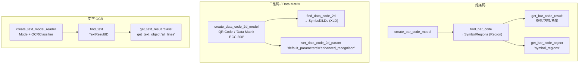

---
tags:
  - Halcon
  - 读码
  - 条码
  - 二维码
  - OCR
aliases:
  - 一维码
  - find_bar_code
  - find_data_code_2d
  - find_text
  - 字符识别
created: 2026-09-16
---

# 16 读码与 OCR 一维码 二维码 字符识别

> [!abstract] 一句话总结
> HALCON 里读码是**三条互不相干的链路**，但套路完全一样 —— **建句柄 → 找 → 取结果（字符串 + 区域）→ 释放句柄**：
>
> | | 一维条码 | 二维码 / Data Matrix | 文字 OCR |
> |---|---|---|---|
> | ① 建模型 | `create_bar_code_model` | `create_data_code_2d_model` | `create_text_model_reader` |
> | ② 执行 | `find_bar_code` | `find_data_code_2d` | `find_text` |
> | ③ 取串 | 第 5 个输出 `DecodedDataStrings` | 第 7 个输出 `DecodedDataStrings` | `get_text_result (…, 'class', …)` |
> | ④ 取区域 | `SymbolRegions`（**Region**）/ `get_bar_code_object` | `SymbolXLDs`（**XLD**） | `get_text_object (…, 'all_lines')` |
> | ⑤ 释放 | `clear_bar_code_model` | `clear_data_code_2d_model` | `clear_text_model` / `clear_text_result` |

> **源文件（本轮新增）：**
> - `note/读码与OCR/01END.hdev`、`01End13.hdev`、`02条码信息.hdev`、`03获取条码区域.hdev`、`04QR码识别.hdev`、`05中文读取.hdev`、`06降噪读码.hdev`
> - `note/读码与OCR/06字符识别.hdev`（OCR）
> - 另见 `note/测量/my/OCR识别.hdev`、`note/测量/my/二维码.hdev`（老师素材里这两个被归在了测量目录下）
>
> **素材：** `note/读码与OCR/End13/*.png`（15 张 EAN-13）、`qrcode/*.png`（9 张工件上的 QR）、`QR码.jpg`、`点码图片/image.png`、`降噪图片/image.png`
>
> ![[降噪_image.png|240]]
> 该图为 `降噪_image.png`（470×460）：一张**带光照渐变和噪点的 Data Matrix ECC 200 码**，正是 `06降噪读码.hdev` 用来演示"直接读读不出来 → 先降噪"的素材。

## 一、三条链路总览



## 二、一维条码

### 2.1 三步骨架

```c
create_bar_code_model ([], [], BarCodeHandle)
find_bar_code (Image, SymbolRegions, BarCodeHandle, 'auto', DecodedDataStrings)
get_bar_code_result (BarCodeHandle, 'all', 'decoded_types', BarCodeResults)
clear_bar_code_model (BarCodeHandle)
```

```c
find_bar_code (Image, SymbolRegions, BarCodeHandle, CodeType, DecodedDataStrings)
```

| 参数 | 说明 |
|---|---|
| `Image` | 输入图（**期望浅底深码**） |
| `SymbolRegions` | 输出：条码所在的 **Region** |
| `BarCodeHandle` | 模型句柄（**第二个输入**，位置别记错） |
| `CodeType` | 码制；`'auto'` = 自动判别所有已知码制 |
| `DecodedDataStrings` | 输出：解码字符串（多个结果用元组返回） |

**支持的码制**（`CodeType` 可取值）：

`2/5 Industrial`、`2/5 Interleaved`、`Codabar`、`Code 32`（由 39 转换）、`Code 39`、`Code 93`、`Code 128`、`EAN-8`、`EAN-13`、`EAN-8 Add-On 2/5`、`EAN-13 Add-On 2/5`、`GS1-128`、`GS1 DataBar` 系列（Omnidirectional / Truncated / Stacked / Stacked Omnidirectional / Limited / Expanded / Expanded Stacked）、`MSI`、`PharmaCode`、`UPC-A`、`UPC-E` 及其 Add-On。

> [!warning] 正反都能读 → 一次可能返回**两个**字符串
> 官方原文：条码可以正向读也可以反向读，两者都是有效结果，因此会**返回两个字符串，并在 `DecodedDataStrings` 里用逗号分隔**。
> 所以别把 `DecodedDataStrings` 当成"一个"字符串用 —— 它可能带逗号。

> [!danger] 条码必须是"浅底深码"
> 官方原文：`find_bar_code` 期望**浅色背景上的深色条码**。
> 遇到深底浅码（反色印刷），**先 `invert_image`** 再读，否则一个都读不出来。

### 2.2 取结果：`get_bar_code_result` / `get_bar_code_object`

```c
get_bar_code_result (BarCodeHandle, CandidateHandle, ResultName, ResultValue)
get_bar_code_object (BarCodeObjects, BarCodeHandle, CandidateHandle, ObjectName)
```
`CandidateHandle` 写 `'all'` 取全部，也可以写 `0..n-1` 指定第几个条码。

| `ResultName` | 返回什么 |
|---|---|
| `'decoded_types'` | 识别出的**码制**（如 `'EAN-13'`） |
| `'decoded_strings'` | 解码字符串（不含强制校验位） |
| `'decoded_reference'` | 含起止符与校验位的**原始**参考数据 |
| `'orientation'` | 条码**方向角** |
| `'element_size'` | 条码元素（最窄条）尺寸 |
| `'quality_isoiec15416'` | 按 ISO/IEC 15416 评的**印刷质量** |
| `'aborted'` | `find_bar_code` 是否被中止（0 正常 / 1 超时 / 2 显式中止） |

`get_bar_code_object` 的 `ObjectName` 常用 `'symbol_regions'`（条码区域）。

> [!danger] `'orientation'` 的单位是**度**，不是弧度！
> 官方原文：该角度以**度**为单位，范围 $[-180.0,\ 180.0]$，**逆时针为正**；
> 并且"**读取方向垂直于条码的条纹**"。
> 这就是为什么源码里写的是 `sin(rad(Rot))` —— 必须先 `rad()` 转成弧度。
> 这也是本库里唯一一个"角度输出用度"的算子（`orientation_region` 等一律是弧度），**别顺手搞混**。

### 2.3 调参：`set_bar_code_param`

```c
set_bar_code_param (BarCodeHandle, 'element_size_min', 8)
```

| 参数 | 作用 |
|---|---|
| `'element_size_min'` | 条码**最窄元素**的最小尺寸（像素）。设了能显著减少误检、提速（01END 里设 8） |
| `'check_char'` | `'absent'`（假定无校验位，不校验）/ `'present'`（校验并从数据里剥离）/ `'preserved'`（校验但**保留**在数据里） |
| `'timeout'` | 超时（毫秒）；超时会让 `'aborted'` 返回 1 |
| `'composite_code'` | 设为 `'CC-A/B'` 才能解 GS1 DataBar 的**复合码**成分 |

### 2.4 `01End13.hdev`：批量读 + 画方向箭头

```c
list_files ('End13', 'files', Files)
create_bar_code_model ([], [], BarCodeHandle)
for Index := 0 to |Files|-1 by 1
    read_image (Image, Files[Index])
    get_image_size (Image, Width, Height)
    find_bar_code (Image, SymbolRegions, BarCodeHandle, 'auto', DecodedDataStrings)
    * 获取中心
    area_center (SymbolRegions, Area, Row, Column)
    get_bar_code_result (BarCodeHandle, 'all', 'orientation', Rot)
    get_bar_code_result (BarCodeHandle, 'all', 'decoded_types', BarCodeResults)
    get_bar_code_result (BarCodeHandle, 'all', 'decoded_strings', string)
    * 箭头
    set_display_font (WindowHandle, 20, 'mono', 'true', 'false')
    dev_set_line_width (5)
    gen_arrow_contour_xld (Arrow, Row+sin(rad(Rot))*60, Column-cos(rad(Rot))*60, \
                           Row-sin(rad(Rot))*60, Column+cos(rad(Rot))*60, 30, 35)
    disp_message (WindowHandle, string, 'Image', Width/2, Height/2, 'green', 'false')
endfor
```

> [!note] 箭头端点为什么这么写
> 方向角 $Rot$ 是"读取方向"（垂直于条纹），逆时针为正。
> 起点 = 质心沿反方向退 60：`(Row + sin·60, Column - cos·60)`；终点 = 沿正方向前进 60：`(Row - sin·60, Column + cos·60)`。
> 注意 **Row 用 `sin`、Column 用 `cos`** —— 因为角度是相对"水平图像轴"量的，跟 [[09 实战 曲别针计数与角度]] 里 `orientation_region` 的 `(Row - L·sin, Column + L·cos)` 是同一套写法。

### 2.5 `02条码信息.hdev`：旋转鲁棒性验证

```c
create_bar_code_model ([], [], BarCodeHandle)
for Index := 0 to 360 by 20
    * 图片绕图像中心旋转
    rotate_image (Image, ImageRotate, Index, 'constant')
    find_bar_code (ImageRotate, SymbolRegions, BarCodeHandle, 'auto', DecodedDataStrings)
    area_center (SymbolRegions, Area, Row, Column)
    get_bar_code_result (BarCodeHandle, 'all', 'decoded_types', BarCodeResults)
    get_bar_code_result (BarCodeHandle, 'all', 'orientation', Rot)
    gen_arrow_contour_xld (Arrow, Row+sin(rad(Rot))*70, Column-cos(rad(Rot))*70, \
                           Row-sin(rad(Rot))*70, Column+cos(rad(Rot))*70, 20, 20)
    disp_message (WindowHandle, DecodedDataStrings, Rot, Row, Column, 'black', 'true')
    stop ()
endfor
```

`rotate_image (Image, ImageRotate, Index, 'constant')` 的第三个参数是**角度（度）**，所以直接 `for Index := 0 to 360 by 20` 就实现了"每 20° 转一次"。
这个循环是很好的**鲁棒性自检**：每转一次都读一次，看 `DecodedDataStrings` 是否恒定、`Rot` 是否跟着角度线性变化。

## 三、二维码 / Data Matrix

```c
create_data_code_2d_model (SymbolType, GenParamName, GenParamValue, DataCodeHandle)
find_data_code_2d (Image, SymbolXLDs, DataCodeHandle, GenParamName, GenParamValue, \
                   ResultHandles, DecodedDataStrings)
```

**支持的 `SymbolType`**：五种主要类型 `'Data Matrix ECC 200'`、`'QR Code'`、`'Micro QR Code'`、`'PDF417'`、`'Aztec Code'`；
外加三种 GS1 变体 `'GS1 DataMatrix'`、`'GS1 QR Code'`、`'GS1 Aztec'`。
（Data Matrix 的 ECC 000-140 **不支持**；QR 支持 Model 1 与 Model 2。）

> [!danger] 二维码的结果是 **XLD**，条码是 **Region**
> `find_data_code_2d` 的第 2 个输出 `SymbolXLDs` 是**亚像素轮廓**（XLD），不是 Region。
> 想做区域运算（如 `area_center`）之前要先 `gen_region_contour_xld` 转换；
> 反过来 `find_bar_code` 给的 `SymbolRegions` 可以直接 `area_center`（01End13 就是这么干的）。

### 3.1 `04QR码识别.hdev`

```c
list_image_files ('qrcode', 'default', [], ImageFiles)
create_data_code_2d_model ('QR Code', [], [], DataCodeHandle)
for Index := 0 to |ImageFiles|-1 by 1
    read_image (Image1, ImageFiles[Index])
    * 检测
    find_data_code_2d (Image1, SymbolXLDs, DataCodeHandle, [], [], ResultHandles, DecodedDataStrings)
    dev_display (Image1)
    dev_display (SymbolXLDs)
    set_tposition (WindowHandle, 100, 100)
    write_string (WindowHandle, '结果' + DecodedDataStrings)
    stop ()
endfor
```

### 3.2 `05中文读取.hdev`：中文必须设编码

```c
* 设置一下转码格式
set_system ('filename_encoding', 'utf8')
read_image (Image, 'QR码')
create_data_code_2d_model ('QR Code', [], [], DataCodeHandle)
find_data_code_2d (Image, SymbolXLDs, DataCodeHandle, [], [], ResultHandles, DecodedDataStrings)
```

> [!danger] 中文路径 / 中文内容两个坑
> ① **中文文件名**：`read_image (Image, 'QR码')` 这种中文路径，必须先 `set_system ('filename_encoding', 'utf8')`，否则读不进图；
> ② **中文内容**：二维码里存了中文时，解出来的 `DecodedDataStrings` 也依賴这个编码设置，否则会是乱码。
> 一句 `set_system ('filename_encoding', 'utf8')` 同时解决两件事，**凡是路径或内容带中文就先写它**。

### 3.3 `06降噪读码.hdev`：读不出来怎么办

这个 hdev 演示了**读不出码的排查顺序**，注释里写得明明白白：

```c
* 1.考虑算子用错了  (改算子)
* 2.图片不清晰 (图像预处理)
```

```c
create_data_code_2d_model ('Data Matrix ECC 200', [], [], DataCodeHandle)
find_data_code_2d (Image, SymbolXLDs, DataCodeHandle, [], [], ResultHandles, DecodedDataStrings)

* 中值滤波
median_image (Image, ImageMedian, 'circle', 1, 'mirrored')
find_data_code_2d (ImageMedian, SymbolXLDs1, DataCodeHandle, [], [], ResultHandles1, DecodedDataStrings1)

* 开运算
gray_opening_shape (Image, ImageOpening, 3, 3, 'octagon')
find_data_code_2d (ImageOpening, SymbolXLDs2, DataCodeHandle, [], [], ResultHandles2, DecodedDataStrings2)
```

| 手段 | 算子 | 干掉了什么 | 代价 |
|---|---|---|---|
| **中值滤波** | `median_image (Image, Out, 'circle', 1, 'mirrored')` | **椒盐噪点**（孤立的黑/白点） | 保边，对"码点内部的颗粒噪"最有效 |
| **灰度开运算** | `gray_opening_shape (Image, Out, 3, 3, 'octagon')` | **亮的**小噪点/毛刺（灰度版开运算） | 会让码点边缘略微变钝，结构元别开太大 |
| **提识别率** | `set_data_code_2d_param (Handle, 'default_parameters', 'enhanced_recognition')` | —— | 更慢，但**难读的码**（畸变、低对比、小尺寸）成功率明显上升 |

> [!tip] 排查顺序建议（把 06 的两条注释补全成三步）
> ① **先确认码制没选错**（Data Matrix 和 QR 长得就不一样，选错 100% 读不出）；
> ② **再降噪** —— 椒盐噪点用 `median_image`，亮噪点用 `gray_opening_shape`；
> ③ **还不行就上 `enhanced_recognition`**（`note/测量/my/二维码.hdev` 里就是这么用的）。

## 四、OCR 字符识别

```c
create_text_model_reader (Mode, OCRClassifier, TextModel)
find_text (Image, TextModel, TextResultID)
get_text_result (TextResultID, ResultName, ResultValue)
get_text_object (Characters, TextResultID, ObjectName)
```

### 4.1 `create_text_model_reader` 的两个参数

| 参数 | 取值 | 说明 |
|---|---|---|
| `Mode` | `'auto'`（**默认、推荐**） | 自动文本分割；**此时必须传 `OCRClassifier`**，且能处理任意字号的文本 |
| | `'manual'` | 手动分割；**忽略 `OCRClassifier`**，但必须用 `set_text_model_param` 自己设字符高宽。适合"极性局部剧烈变化"（如刻印/反光字符）或"没有合适的分类器" |
| `OCRClassifier` | 见下 | 必须是 **CNN 或 MLP** 分类器，**强烈建议带拒绝类（`_Rej`）** |

**分类器文件名的命名规律**（本轮源码里出现了 4 个）：

| 文件名 | 拆解 |
|---|---|
| `Universal_0-9A-Z_Rej.occ` | `Universal`（通用字体）+ `0-9A-Z`（字符集：数字+大写字母）+ `Rej`（**带拒绝类**）+ `.occ`（**CNN** 分类器） |
| `Universal_A-Z+_Rej.occ` | 字符集 = 大写字母 + `+` |
| `Pharma_0-9A-Z_Rej.omc` | `Pharma`（医药字体）+ `.omc`（**MLP** 分类器） |
| `Document_0-9_Rej.omc` | `Document`（文档字体）+ 只有数字 |

> [!note] `.occ` = CNN，`.omc` = MLP
> 后缀区分分类器类型：**`.occ` 用 `read_ocr_class_cnn` 读，`.omc` 用 `read_ocr_class_mlp` 读**。
> 直接把文件名当字符串传进 `create_text_model_reader` 即可（HALCON 会从标准目录找）。
> `_Rej` 表示**带拒绝类** —— 遇到不认识的字会拒识而不是硬猜一个错字，工程上强烈建议用。

### 4.2 `06字符识别.hdev`

```c
* 06,OCR字符识别
read_image (Image, 'ocr/article_label_01.png')
dev_get_window (WindowHandle)
dev_set_draw ('margin')
* 画一块区域
draw_rectangle2 (WindowHandle, Row, Column, Phi, Length1, Length2)
gen_rectangle2 (Rectangle, Row, Column, Phi, Length1, Length2)
* 抠出来
reduce_domain (Image, Rectangle, ImageReduced)

* 创建测量句柄
create_text_model_reader ('auto', 'Universal_0-9A-Z_Rej.occ', TextModel)
* 运行测量句柄
find_text (ImageReduced, TextModel, TextResultID)
* 获取字符结果
get_text_result (TextResultID, 'class', ResultValue)
* 获取识别到的区域
get_text_object (Characters, TextResultID, 'all_lines')
dev_clear_window ()
dev_display (Image)
dev_display (Characters)
```

> [!tip] OCR 之前先 `reduce_domain` 限定 ROI
> 跟 [[14 模板匹配 形状匹配]] 抠模板一个道理：先用 `draw_rectangle2 + gen_rectangle2 + reduce_domain` 把**只含文字的那一块**圈出来，
> 既提速又避免把旁边的图案误当成字符。**别整幅图丢给 `find_text`**。

### 4.3 `note/测量/my/OCR识别.hdev`：换分类器 + 设字符高度

```c
create_text_model_reader ('auto', 'Universal_A-Z+_Rej.occ', TextModel2)
create_text_model_reader ('auto', 'Pharma_0-9A-Z_Rej.omc', TextModel)
find_text (ImageReduced, TextModel, TextResultID)
get_text_result (TextResultID, 'class', ResultValue)
get_text_object (Characters, TextResultID, 'all_lines')

* 第二章图换了思路：显式设字符高度
create_text_model_reader ('auto', 'Universal_A-Z+_Rej.occ', TextModel1)
set_text_model_param (TextModel1, 'min_char_height', 'auto')
find_text (ImageReduced1, TextModel1, TextResultID1)
```

`set_text_model_param (TextModel, 'min_char_height', 'auto' | 数值)` 用来限制"最小字符高度"，能过滤掉画面里比目标文字小得多的噪声块；`'auto'` 表示交给 HALCON 自己判断。

## 五、坑位清单

> [!warning] 读码与 OCR 十二坑
> 1. **`'orientation'` 的单位是度**（范围 −180~180，逆时针为正），全库独一份；用之前记得 `rad()`。
> 2. **条码期望"浅底深码"**：深底浅码必须先 `invert_image`。
> 3. **条码结果 = Region，二维码结果 = XLD**：`area_center` 只能直接吃前者。
> 4. **正反都能读** → `DecodedDataStrings` 可能是"两个串用逗号分隔"，别当单个串解析。
> 5. **中文路径 / 中文内容**：先 `set_system ('filename_encoding', 'utf8')`。
> 6. **码制别选错**：`'auto'` 会试遍所有码制（慢），已知码制就写死；Data Matrix 与 QR 完全不同。
> 7. **`Code32` 要用 `Code 39` 读**，再用 `convert_decoded_string_code39_to_code32` 转。
> 8. **句柄要 `clear`**：`clear_bar_code_model` / `clear_data_code_2d_model` / `clear_text_model` + `clear_text_result`，循环里反复 `create` 会吃内存。
> 9. **`create_bar_code_model ([], [], Handle)` 的两个空元组不是摆设** —— 那是 `GenParamName` / `GenParamValue`，调 `'check_char'` 之类就在这里或 `set_bar_code_param` 里给。
> 10. **`Mode='auto'` 必须给 `OCRClassifier`**；`Mode='manual'` 会**忽略**它、但必须自己设字符高宽。
> 11. **OCR 前先 `reduce_domain` 圈 ROI**，别整幅图丢进去。
> 12. **素材路径要重改**：`03获取条码区域.hdev` 用的是 HALCON 示例目录 `'barcode/code39'`；`note/测量/my/二维码.hdev` 用的是 `D:/Users/21632/Downloads/...` 绝对路径 —— 换机器都得改。
> 13. **`set_tposition` + `write_string` / `disp_message (200000, …)` 是老写法**，新版一律用 `dev_disp_text (Text, 'window', Row, Column, Color, [], [])`。

## 六、自检

> [!question]
> 1. 一维码 / 二维码 / OCR 三条链路的"建模型—执行—取结果"算子分别叫什么？
> 2. `find_bar_code` 和 `find_data_code_2d` 输出的区域类型有什么不同？各自怎么取质心？
> 3. `get_bar_code_result (…, 'orientation', …)` 返回的单位是什么？范围？源码里为什么要 `rad(Rot)`？
> 4. 条码是"深底浅码"时该怎么办？为什么？
> 5. 中文文件名读不进来，该怎么解决？中文内容乱码呢？
> 6. `element_size_min`、`check_char`、`timeout` 三个参数分别管什么？
> 7. 读不出二维码时，`06降噪读码.hdev` 给的排查顺序是什么？`median_image` 与 `gray_opening_shape` 各去掉什么？
> 8. `Universal_0-9A-Z_Rej.occ` 这个文件名每一段分别代表什么？`.occ` 和 `.omc` 的区别？
> 9. `create_text_model_reader` 的 `Mode` 取 `'auto'` 和 `'manual'` 各有什么强制要求？
> 10. 为什么 OCR 之前要先 `reduce_domain`？

---

上一步：[[15 测量模型 2D Metrology]] · 相关：[[05 图像预处理与滤波]]、[[06 形态学运算]] · 回到：[[00 Halcon学习地图]]
